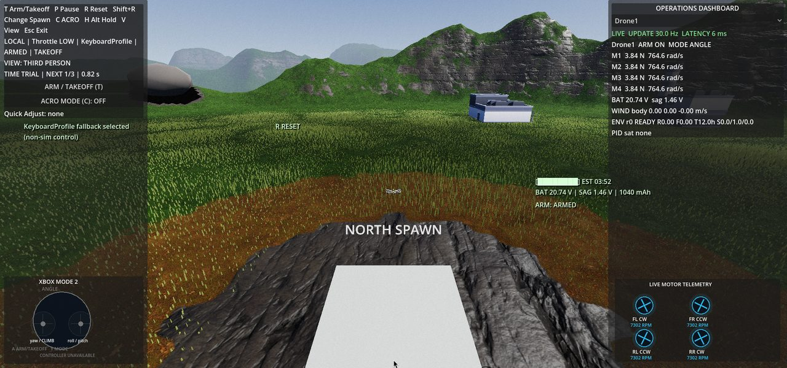
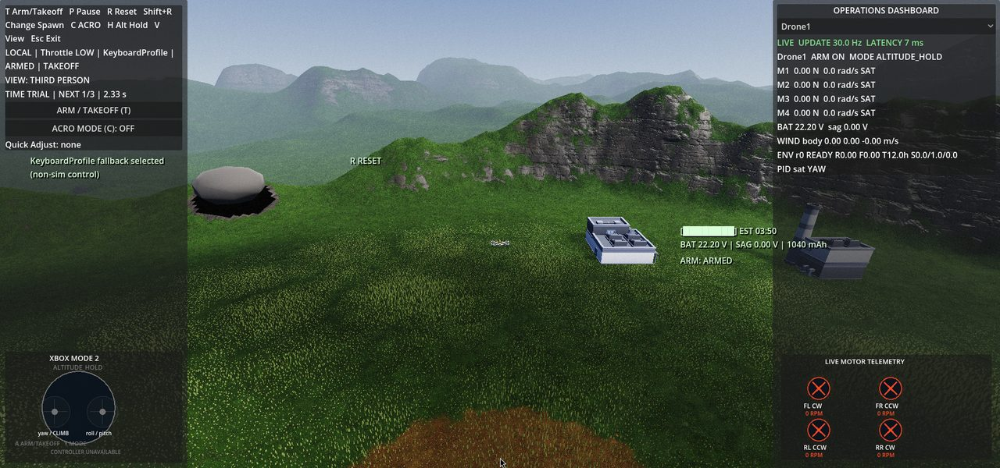
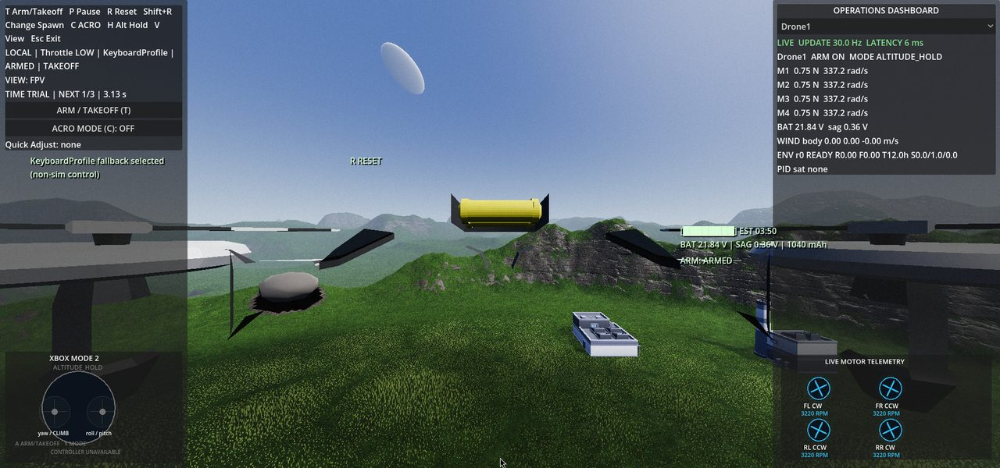
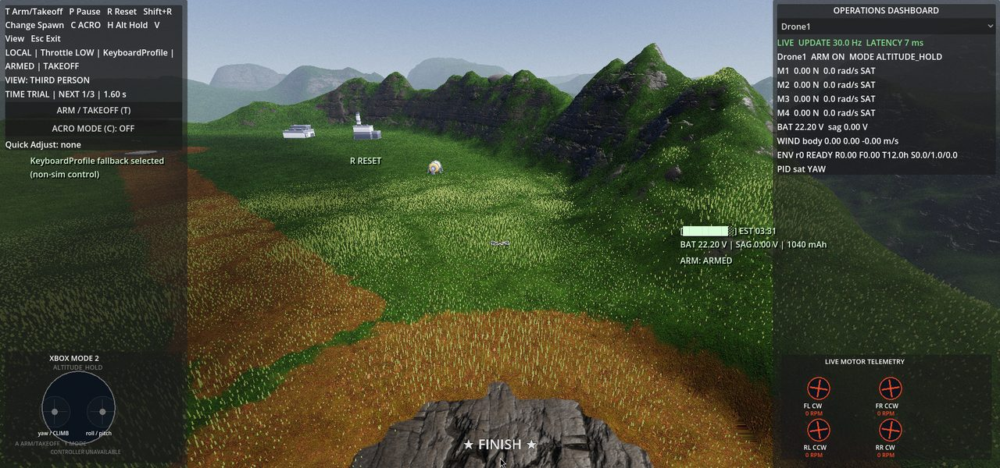
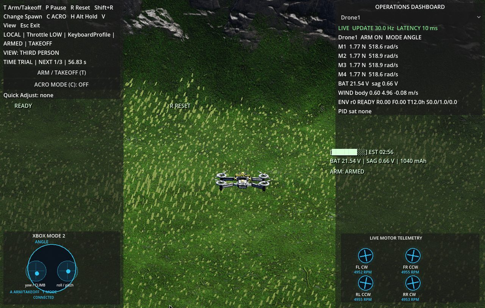
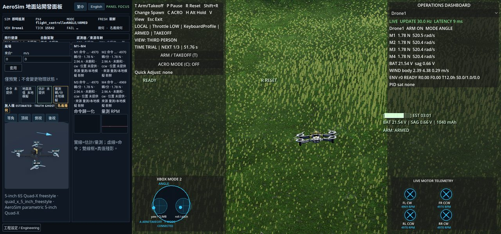
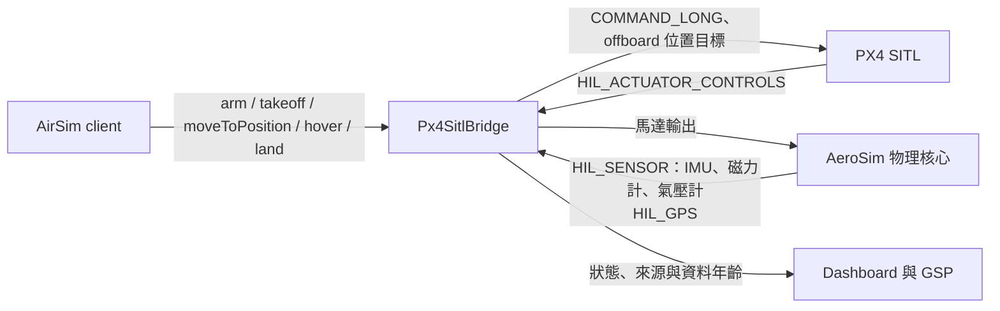
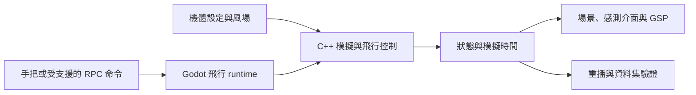

# AeroSim

> **授權：僅限非商業用途，歡迎研究、教學與交流。** 完整條款見 [LICENSE](LICENSE)，適用範圍與第三方例外見 [授權規範](LICENSING.md)。

可手動飛行、觀察感測資料並重播控制輸入的多旋翼模擬專案。它讓飛行控制與模擬實作者，在同一個虛擬場景中追查「輸入、風場、機體反應與儀表讀值」之間的關係。

目前 repo 包含 Godot 飛行場景、C++ 模擬核心、AirSim 相容介面的部分實作，以及本機飛行調校面板。可先閱讀 [手把操作](docs/player_mode_xbox_controls.md)、[GSP 幾何與資料呈現](docs/gsp_drone_geometry.md) 和 [資料集格式](docs/dataset_recording.md)，或依下方 Linux 步驟建置。完整 AirSim-class 最低產品驗收仍未完成，不能將個別測試通過等同於整套平台已就緒。

## 能觀察與操作什麼

| 目前程式中的能力 | 入口與可查驗內容 | 邊界 |
| --- | --- | --- |
| 手動飛行與重試 | [飛行 runtime](common/flight/flight_runtime.gd) 串起主選單、Quick Fly、出生點、暫停、重置與飛行控制 | Player Mode 可玩性里程碑 CAP-006 尚未完整驗收；鍵盤是備援操作 |
| 參數化機體與物理步進 | [機體設定](config/drones/)、[原生核心](src/native/aerosim_native.cpp) 將推力、姿態、速度及風場納入模擬 | 模擬輸出不等於已經真機校準的預測 |
| 觀察風與控制反應 | [GSP 面板](common/gsp/) 顯示控制命令、機體狀態與馬達資料，並區分來源及資料時效 | 本機 debug 調校工具；PX4 資料是否可見取決於 transport 與 SITL 設定 |
| 程式控制及感測介面 | runtime 接上 AirSim RPC、命名載具、感測與相機 backend；[相容性清單](config/airsim_compatibility_manifest.json) 定義支援範圍 | 是受限相容介面，不能假設所有 Microsoft AirSim API、場景或外掛都可直接使用 |
| 重播與分析資料 | [重播核心](src/native/aerosim_replay.cpp) 重算輸入序列；[DatasetWriter／Reader](dataset/portable.py) 封裝、驗證錄製資料 | 飛行重播與資料集錄製是不同成果；完整產品 session 與跨環境驗收需分別確認 |

[產品能力表](docs/product_capabilities.md) 和 [PRD](PRD_AeroSim.md) 保留完整目標與驗收門檻。其中有些較早的 `Current evidence` 段落仍描述尚無 RPC、風場或資料集功能，與目前 runtime／writer 已存在的實作不同。本 README 以上列程式入口說明「已有實作」，不將這個差異解讀為所有產品門檻已通過。

## 飛行畫面與系統功能

以下截圖都在飛行中擷取。環境：2026-09-17，commit `e15fc63`，`template_debug` 原生建置，Godot 4.7.2 Forward+（Vulkan、NVIDIA RTX 4060 Ti），地圖 Terrain Range。以 AirSim settings 啟動一台 `SimpleFlight` 載具 `Drone1`（內建飛控，不是 PX4），並開啟 GSP 面板。畫面上的推力、轉速、電量與風速都是當次模擬讀值，不是真機量測，也不代表其他設備的顯示或效能。

### 起飛：HUD 與 Operations Dashboard



從主選單按 `Quick Fly` 會載入預設機體與地圖，並先要求確認輸入：可選 Xbox Mode 2 預設設定檔或鍵盤備援；未確認前無法解鎖。解鎖起飛後的畫面分為四區：

- **左上 HUD**：快捷鍵（`T` 解鎖起飛、`P` 暫停、`R` 重置、`Shift+R` 換出生點、`C` ACRO、`H` 定高、`V` 視角、`Esc` 離開），以及控制來源（LOCAL）、油門、輸入設定檔、解鎖狀態、視角、Time Trial 計時與 Quick Adjust 狀態。
- **右上 Operations Dashboard**：以 30 Hz 更新，可切換載具（圖中為 `Drone1`），列出連線延遲、飛行模式、M1–M4 推力與角速度、電池電壓與壓降、機體座標風速、環境狀態，以及 PID 飽和軸。
- **中右電池估計**：剩餘飛行時間、電壓、壓降與容量。
- **下方**：左側以 Xbox Mode 2 雙搖桿圖示顯示目前輸入與手把連線狀態；右側 `LIVE MOTOR TELEMETRY` 依 FL／FR／RL／RR 顯示各馬達轉向與 RPM。

### 定高與飽和提示



按 `H` 會以目前高度作為目標進入定高，Dashboard 和搖桿圖示同步顯示 `ALTITUDE_HOLD`。這張截圖拍在剛切入定高、控制器煞停爬升的瞬間：M1–M4 標示 `SAT`（輸出飽和）、`PID sat YAW`，馬達遙測轉為紅色。這是模擬器讓你看到控制器被限制的時刻，不是故障畫面。

### FPV 視角



按 `V` 在第三人稱與 FPV 間切換；HUD 的 `VIEW` 欄位同步更新，遙測在兩種視角都保留。可在暫停選單的 `CAMERA` 調整相機設定。

### 出生點與 Time Trial



`Shift+R` 依序切換地圖的出生點，`R` 重置回目前出生點。地圖若定義了 Time Trial 路線，HUD 會顯示下一個檢查點（`NEXT 1/3`）與經過時間，進入檢查點 2.5 m 範圍內即算通過；圖中可見終點的 `FINISH` 標記。

### Demo Flight 與風場



主選單的 `Drone` 或 `Map` 會進入 Flight Setup，可選機體、地圖與風場預設（Calm／Light／Moderate／Severe），接著按 `FLY` 手動飛行，或按 `Demo Flight` 由內建路線自動飛完約 180 秒：懸停 → 低空通過 → 環繞 → 爬升 → 返航 → 降落。途中有碰撞、速度與高度安全限制，超限會中止。圖中使用 Moderate 風場，Dashboard 的 `WIND body` 顯示機體座標下約 5 m/s 的風，可與馬達推力、姿態反應對照。

### 地面站 GSP



GSP（Ground Station Panel，地面站開發面板）是本機瀏覽器面板，只在 debug build 啟用，透過 `127.0.0.1` 與每次啟動產生的 token 連線。從暫停選單按 `OPEN GSP PANEL` 開啟；在 X11 上，Demo Flight 會把遊戲視窗與面板左右並排（如圖）。面板內容：

- **頂列**：遙測來源、飛控（圖中 `flight_controller` 為內建飛控）、模式與解鎖、資料新鮮度、載具、模擬 tick、失效狀態，以及幾何模型分類。
- **飛行健康／自動駕駛／感測器與來源年齡**：PX4 MAVLink、估測器、飛行模式、安全狀態，以及 GPS、IMU、氣壓計、磁力計的資料年齡。沒有資料就顯示「未提供」，不補零；圖中是內建飛控，所以 PX4 欄位都是「未提供」。
- **風場**：以氣象慣例「來自」方位與 m/s 輸入，先`預覽`（不改變物理），再`套用`。套用會在下一個權威物理 tick 生效、回傳 ACK，並寫入 Flight Replay 事件。
- **無人機檢視**：以作用中硬體設定產生的 Quad-X 幾何，可切換等角／頂視／側視／後視；藍色箭頭表示風向。資料分為命令、地面真值、估計、量測四類來源，實線是估計／量測，虛線是命令，雙線框是真值殘影。
- **M1–M4**：每顆馬達的命令、轉速、推力、電流、飽和與轉向，以及命令歸一化和量測 RPM 曲線。
- **工程設定 / Engineering**：完整 TelemetrySnapshot（NED／FRD／SI）、目前硬體設定（唯讀）、幾何模型來源、Quick Adjust、In-flight Quick Adjust 與 Presets。

面板 URL 含控制權 token，不要分享。連線細節見[本機開發操作](docs/local-development.md)。

### 其他系統功能

| 功能 | 內容 | 入口 |
| --- | --- | --- |
| 機體 | `5-inch 6S`、`5-inch 6S race`、`PX4 Iris`；推力、轉速、電流與幾何都由設定檔提供 | Flight Setup、[`config/drones/`](config/drones/) |
| 地圖 | Terrain Range（預設）、Industrial Yard，各有多個出生點 | Flight Setup、[`config/maps/`](config/maps/) |
| 輸入 | Xbox Mode 2 手把（需確認軸對應）、鍵盤備援（固定油門，標示 non-sim control）、控制器監看 | 主選單 `Controller`、暫停選單 `CONTROLLER MONITOR` |
| 飛行模式 | Angle（自穩）、Acro（角速率，套用 Betaflight RC Rate／Super Rate／Expo）、Altitude Hold | `C`、`H`；暫停選單 `RATES` 可預覽曲線與匯出／匯入 JSON |
| 暫停選單 | RESUME、RESET、CHANGE SPAWN、RATES、CAMERA、OSD、CONTROLLER MONITOR、STATUS DIAGRAM、OPEN GSP PANEL、COPY GSP URL、EXIT | `P` |
| 設定 | 圖形、語言（繁中／English）、原廠重設 | 主選單 `Settings` |
| Lab Mode | 以完整版 Operations Dashboard 取代飛行中的精簡版 | 主選單 `Lab Mode` |
| Quick Adjust | 飛行中以按鍵微調指定參數，HUD 顯示目前值 | HUD、GSP 工程設定 |
| AirSim RPC | 以 pinned `airsim==1.8.1` client 控制具名載具：起飛、降落、懸停、返航、位置／速度／偏航／角速率命令，以及感測器、相機、環境與場景物件 API；只接受 [相容性清單](config/airsim_compatibility_manifest.json) 列出的操作，其餘回明確錯誤 | `--airsim-settings-file`，預設 `127.0.0.1:41451` |
| 重播與資料集 | Flight Replay 逐幀重算輸入；Dataset Recording 輸出含驗證的 manifest | [重播核心](src/native/aerosim_replay.cpp)、[資料集格式](docs/dataset_recording.md) |

## PX4 SITL 模擬

AeroSim 可以把飛行控制交給 PX4 software-in-the-loop（SITL）：PX4 負責估測與控制，AeroSim 負責物理、感測器與場景。截圖使用內建飛控；本機沒有建置 PX4，這一節依程式與測試腳本說明，不代表本次已跑過真實 PX4。



- **啟用方式**：在 AirSim settings 把載具設為 `"VehicleType": "PX4Multirotor"`，範例見 [`config/sitl/px4_iris.json`](config/sitl/px4_iris.json)。PX4 以 TCP `4560` 連入；offboard 控制使用 UDP `14540`／`14580`。`LockStep` 讓 PX4 與模擬器共用模擬時間。
- **感測與致動**：AeroSim 依模擬狀態送出 IMU、磁力計、氣壓計與 GPS（GPS 間隔由 `HilGpsIntervalSeconds` 設定，風場驗證設定使用 0.05 秒）；PX4 回傳 `HIL_ACTUATOR_CONTROLS`，依 `HilActuatorQuadXOrder` 對應到 AeroSim 的馬達順序。
- **機體**：[`config/drones/px4_iris.json`](config/drones/px4_iris.json) 取用 PX4 Iris SDF 的質量、慣量、旋翼與推力參數，讓 PX4 預設 Iris 調參能在 AeroSim 上合理飛行。
- **任務流程**：AirSim client 可對 PX4 載具下 arm、takeoff、moveToPosition、hover、land。bridge 會等估測器回報就緒才解鎖，並以 10 Hz 送 offboard 位置目標（進入 offboard 前先預熱 1 秒）。
- **失效即停**：PX4 心跳或致動輸出逾時時，bridge 轉為 `stale`／`failed` 並回報錯誤，不會偷偷改用內建飛控。PX4 掌控時，GSP 的 Quick Adjust 等飛行中調參會回 `external_authority` 並被拒絕，避免兩個控制來源互相干擾。
- **可觀測性**：Dashboard 與 GSP 顯示 PX4 連線、估測器、模式、解鎖、目標、馬達命令與回授，並標示資料來源（`px4_mavlink` 或 `px4_bridge`）與年齡。
- **範圍**：固定 PX4 版本 `1dacb4c`；一個 session 只支援一台 PX4 載具（第二台可用 `SimpleFlight`）。ArduPilot SITL 與硬體迴圈（HITL）不在範圍內。

執行方式：

```bash
# 檢查 PX4 原始碼版本，並以假 transport 跑一趟 PX4 任務（不需建置 PX4）
GODOT_BIN="$GODOT_BIN" scripts/test_px4_sitl_launcher.sh --check --fake-smoke

# 下載並建置 pinned PX4，啟動 AeroSim 與 PX4，執行 arm → takeoff → moveToPosition → hover → land → disarm
GODOT_BIN="$GODOT_BIN" scripts/test_px4_sitl_launcher.sh --run

# 額外執行風階躍驗證
GODOT_BIN="$GODOT_BIN" scripts/test_px4_sitl_launcher.sh --run --wind-step-qualification
```

本次在本機執行第一行，結果為 `PX4 fake mission: completed and disarmed`；`--run` 需要完整 PX4 建置環境，未在本機執行。風階躍驗證（[`scripts/px4_wind_step_qualification.py`](scripts/px4_wind_step_qualification.py)）要求證據來自 pinned PX4 真實 transport 且由 PX4 獨占控制，並檢查：風場套用 tick 與 replay 事件一致、致動輸出新鮮（0.5 秒內）且馬達對應已驗證、機體對風有可觀測的傾角反應，以及位置誤差 RMS／最大值在凍結限制內。缺少任何證據都判為失敗或 unavailable，不會宣稱通過。

## 如何把一次飛行變成可分析的過程



Godot 負責場景、互動與顯示，C++ GDExtension（讓 Godot 呼叫原生程式的擴充）負責模擬核心。這樣能把飛行計算獨立做原生測試，代價是必須管理引擎、繫結版本、原生編譯與顯示整合。

兩個值得深入看的設計：

- **可重複不靠畫面看起來一樣。** `replay_angle_mode_batch()` 從初始狀態逐幀重算，遇到無效步進會回報失敗幀；建置關閉浮點運算 contraction。[重播測試](tests/native/test_replay.cpp) 區分同平台 bitwise replay 與跨平台容忍值（姿態差不超過 0.5 度、位置差不超過 0.05 m），不能據此宣稱任意硬體上每個浮點值都相同。
- **錄到檔案不等於資料完整。** `DatasetWriter.finalize()` 寫入 manifest 後執行驗證，失敗會標成 `interrupted`。時間戳、缺樣、相對路徑與檔案雜湊都是 [資料集契約](config/dataset_schema.json) 的一部分，讓後續分析能辨識缺漏。

## Linux 快速開始

需要 repo 存取權、Python 3、相容 C++17 編譯器、SCons，以及 Godot **4.7 以上的 stable 版本**（例如 4.7.2）。版本選擇與基準雜湊見 [版本規範](docs/versions/godot-4.7.lock)；`godot-cpp` 已放在 `third_party/godot-cpp/`。匯出模板必須與引擎版本一致，各版本仍需通過既有測試。

```bash
git clone https://github.com/KarlSideProjects/AeroSim.git
cd AeroSim
python3 -m venv .deps/venv
. .deps/venv/bin/activate
python3 -m pip install scons
GODOT_CPP_DIR=third_party/godot-cpp scons target=template_debug platform=linux
export GODOT_BIN=/absolute/path/to/Godot_v4.7-stable_linux.x86_64
"$GODOT_BIN" --editor --path .
```

編輯器按 `F5` 執行主場景 `levels/smoke/smoke.tscn`，或關閉編輯器後直接啟動：

```bash
"$GODOT_BIN" --path .
```

從畫面選擇 Quick Fly，依輸入確認與起飛提示操作。Xbox 手把採 Mode 2：左桿控制偏航與油門，右桿控制滾轉與俯仰；詳見 [完整操作與輸入判讀](docs/player_mode_xbox_controls.md)。沒有手把時依鍵盤提示使用備援控制。

若找不到 `libaerosim_native`，先確認上述 SCons 建置成功。一般飛行展示不需要真實無人機；PX4 SITL 整合測試需要另備對應軟體與設定。桌面繪圖有 Compatibility fallback，但效能與顯示結果仍需在實際設備驗證，不能套用指定 reference runner 的量測值。

## 本機調校與驗證入口

GSP 是本機瀏覽器面板，透過 loopback 與每次啟動產生的 token 連線。一般 debug 操作可在暫停選單按 `OPEN GSP PANEL`；無法開啟時使用 `COPY GSP URL`。連線資訊、替代開啟方式及 DEV-M 授權 fixture 已移至 [本機開發操作](docs/local-development.md)，保留原有操作細節。不要分享含 token 的執行期 URL。

純文件檢查：

```bash
python3 scripts/check_docs.py
```

此檢查也解析 workflow YAML，需要 PyYAML；可在上方虛擬環境安裝 `python3 -m pip install PyYAML`。

需要開發驗證時，可分層執行：

```bash
scripts/test_native.sh
scripts/check_hardcoded_airframe_constants.sh
python3 scripts/check_licenses.py
scripts/test_license_scan.sh
```

授權伺服器測試另需 Python 3.11 與 [鎖定的 Python 依賴](license_server/requirements.lock)，使用獨立測試環境：

```bash
PYTHON_BIN=python3.11 scripts/test_license_dependencies.sh
build/license-venv/bin/python -m unittest license_server.test_license_server
```

完整 Linux gate 還使用 Node.js、瀏覽器驗證工具及 Godot；請對照 [腳本](scripts/verify_issue_11.sh) 與 [CI workflow](.github/workflows/ci.yml) 準備環境：

```bash
mkdir -p build/runner-temp
RUNNER_TEMP="$PWD/build/runner-temp" GODOT_BIN="$GODOT_BIN" scripts/verify_issue_11.sh
```

該 gate 會建置並記錄原生產物來源。成功後，可用相同 commit 與產物重跑 headless smoke（不開視窗的整合檢查）：

```bash
GODOT_BIN="$GODOT_BIN" scripts/run_headless_smoke.sh --output build/headless_smoke.json --frames 5
```

預期輸出 JSON 與軌跡 CSV；腳本會檢查產物來源是否對應目前 HEAD，單獨跑 SCons 不會產生所需的 provenance 收據。無視窗 smoke、實際視窗驗收、release 打包與 GPU 效能是不同 gate。

本次 README 整理檢查了來源、設定及文件路徑，沒有重跑完整原生／Godot／PX4／GPU gate。現有 [CI](.github/workflows/ci.yml)、[效能紀錄](docs/performance/) 與 [能力驗收說明](docs/product_capabilities.md) 應連同各自 commit、環境與限制閱讀；CAP-006 之前的 AI 視覺驗證仍是暫定證據，不等於正式人工可用性驗收。

## 探究與工程學習的延伸

可以固定機體設定與控制序列，只改變風場，觀察姿態、位置及馬達反應；再比較模擬真值、感測值與估計值，練習辨識誤差來源。重播與資料完整性契約也適合討論「實驗可重複」和「資料可查驗」的差別。

這些是以現有介面為基礎的活動方向，尚未宣稱完成教學研究、真機遷移或學習成效驗證。若延伸到防災或公共決策，仍須另建立場景、有效性依據與評估設計。

## 來源、授權與貢獻

- Microsoft AirSim 是鎖定版本的相容性與實作參考，並非整套成果由本專案原創；引用規則見 [AirSim Reference Policy](docs/airsim_reference_policy.md)。
- Godot、godot-cpp、Terrain3D、GUT、Three.js、場景材質及其他依賴的來源與 notices 見 [第三方清單](third_party/licenses.json) 和各自授權檔；允許清單不是整個專案的授權。
- 作者有權授權的內容依 [非商用研究授權](LICENSE) 發行，歡迎非商用研究、教學、修改與交流。第三方、獨立 MIT 幾何元件及既有權利見 [LICENSING.md](LICENSING.md)，不能把依賴的 MIT／CC0 擴張為全庫商用許可。
- 本 README 描述目前 repo 的協作成果；個人貢獻需沿 commit／PR 紀錄確認，不將所有程式、素材與上游工作歸於單一作者。
