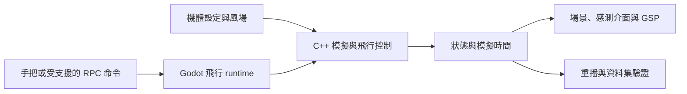

# AeroSim

可手動飛行、觀察感測資料並重播控制輸入的多旋翼模擬專案。它讓飛行控制與模擬實作者，在同一個虛擬場景中追查「輸入、風場、機體反應與儀表讀值」之間的關係。

目前 repo 包含 Godot 飛行場景、C++ 模擬核心、AirSim 相容介面的部分實作，以及本機飛行調校面板。可先閱讀 [手把操作](docs/player_mode_xbox_controls.md)、[GSP 幾何與資料呈現](docs/gsp_drone_geometry.md) 和 [資料集格式](docs/dataset_recording.md)，或依下方 Linux 步驟建置。完整 AirSim-class 最低產品驗收仍未完成，不能將個別測試通過等同於整套平台已就緒。

## 能觀察與操作什麼

| 目前程式中的能力 | 入口與可查驗內容 | 邊界 |
| --- | --- | --- |
| 手動飛行與重試 | [飛行 runtime](common/flight/flight_runtime.gd) 串起主選單、Quick Fly、出生點、暫停、重置與飛行控制 | Player Mode 可玩性里程碑 CAP-006 尚未完整驗收；鍵盤是備援操作 |
| 參數化機體與物理步進 | [機體設定](config/drones/)、[原生核心](src/native/aerosim_native.cpp) 將推力、姿態、速度及風場納入模擬 | 模擬輸出不等於已經真機校準的預測 |
| 觀察風與控制反應 | [GSP 面板](common/gsp/) 顯示控制命令、機體狀態與馬達資料，並區分來源及資料時效 | 本機 debug 調校工具；PX4 資料是否可見取決於 transport 與 SITL 設定 |
| 程式控制及感測介面 | runtime 接上 AirSim RPC、命名載具、感測與相機 backend；[相容性清單](config/airsim_compatibility_manifest.json) 定義支援範圍 | 是受限相容介面，不能假設所有 Microsoft AirSim API、場景或外掛都可直接使用 |
| 重播與分析資料 | [重播核心](src/native/aerosim_replay.cpp) 重算輸入序列；[DatasetWriter／Reader](dataset/portable.py) 封裝、驗證錄製資料 | 飛行重播與資料集錄製是不同成果；完整產品 session 與跨環境驗收需分別確認 |

[產品能力表](docs/product_capabilities.md) 和 [PRD](PRD_AeroSim.md) 保留完整目標與驗收門檻。其中有些較早的 `Current evidence` 段落仍描述尚無 RPC、風場或資料集功能，與目前 runtime／writer 已存在的實作不同。本 README 以上列程式入口說明「已有實作」，不將這個差異解讀為所有產品門檻已通過。

## 如何把一次飛行變成可分析的過程



Godot 負責場景、互動與顯示，C++ GDExtension（讓 Godot 呼叫原生程式的擴充）負責模擬核心。這樣能把飛行計算獨立做原生測試，代價是必須管理引擎、繫結版本、原生編譯與顯示整合。

兩個值得深入看的設計：

- **可重複不靠畫面看起來一樣。** `replay_angle_mode_batch()` 從初始狀態逐幀重算，遇到無效步進會回報失敗幀；建置關閉浮點運算 contraction。[重播測試](tests/native/test_replay.cpp) 區分同平台 bitwise replay 與跨平台容忍值（姿態差不超過 0.5 度、位置差不超過 0.05 m），不能據此宣稱任意硬體上每個浮點值都相同。
- **錄到檔案不等於資料完整。** `DatasetWriter.finalize()` 寫入 manifest 後執行驗證，失敗會標成 `interrupted`。時間戳、缺樣、相對路徑與檔案雜湊都是 [資料集契約](config/dataset_schema.json) 的一部分，讓後續分析能辨識缺漏。

## Linux 快速開始

需要 repo 存取權、Python 3、相容 C++17 編譯器、SCons，以及專案鎖定的 [Godot 4.7-stable](https://github.com/godotengine/godot/releases/tag/4.7-stable)。版本與雜湊見 [版本鎖定檔](docs/versions/godot-4.7.lock)；`godot-cpp` 已放在 `third_party/godot-cpp/`。此處依 repo 的版本契約操作，不代表任意 Godot 4.x 都相容。

```bash
git clone https://github.com/KarlSideProjects/AeroSim.git
cd AeroSim
python3 -m venv .deps/venv
. .deps/venv/bin/activate
python3 -m pip install scons
GODOT_CPP_DIR=third_party/godot-cpp scons target=template_debug platform=linux
export GODOT_BIN=/absolute/path/to/Godot_v4.7-stable_linux.x86_64
"$GODOT_BIN" --editor --path .
```

編輯器按 `F5` 執行主場景 `levels/smoke/smoke.tscn`，或關閉編輯器後直接啟動：

```bash
"$GODOT_BIN" --path .
```

從畫面選擇 Quick Fly，依輸入確認與起飛提示操作。Xbox 手把採 Mode 2：左桿控制偏航與油門，右桿控制滾轉與俯仰；詳見 [完整操作與輸入判讀](docs/player_mode_xbox_controls.md)。沒有手把時依鍵盤提示使用備援控制。

若找不到 `libaerosim_native`，先確認上述 SCons 建置成功。一般飛行展示不需要真實無人機；PX4 SITL 整合測試需要另備對應軟體與設定。桌面繪圖有 Compatibility fallback，但效能與顯示結果仍需在實際設備驗證，不能套用指定 reference runner 的量測值。

## 本機調校與驗證入口

GSP 是本機瀏覽器面板，透過 loopback 與每次啟動產生的 token 連線。一般 debug 操作可在暫停選單按 `OPEN GSP PANEL`；無法開啟時使用 `COPY GSP URL`。連線資訊、替代開啟方式及 DEV-M 授權 fixture 已移至 [本機開發操作](docs/local-development.md)，保留原有操作細節。不要分享含 token 的執行期 URL。

純文件檢查：

```bash
python3 scripts/check_docs.py
```

此檢查也解析 workflow YAML，需要 PyYAML；可在上方虛擬環境安裝 `python3 -m pip install PyYAML`。

需要開發驗證時，可分層執行：

```bash
scripts/test_native.sh
scripts/check_hardcoded_airframe_constants.sh
python3 scripts/check_licenses.py
scripts/test_license_scan.sh
python3 -m unittest license_server.test_license_server
```

授權伺服器測試另需 Python 3.11 與 [鎖定的 Python 依賴](license_server/requirements.lock)，安裝方式與檢查見 `scripts/test_license_dependencies.sh`。完整 Linux gate 還使用 Node.js、瀏覽器驗證工具及 Godot；請對照 [腳本](scripts/verify_issue_11.sh) 與 [CI workflow](.github/workflows/ci.yml) 準備環境：

```bash
mkdir -p build/runner-temp
RUNNER_TEMP="$PWD/build/runner-temp" GODOT_BIN="$GODOT_BIN" scripts/verify_issue_11.sh
```

該 gate 會建置並記錄原生產物來源。成功後，可用相同 commit 與產物重跑 headless smoke（不開視窗的整合檢查）：

```bash
GODOT_BIN="$GODOT_BIN" scripts/run_headless_smoke.sh --output build/headless_smoke.json --frames 5
```

預期輸出 JSON 與軌跡 CSV；腳本會檢查產物來源是否對應目前 HEAD，單獨跑 SCons 不會產生所需的 provenance 收據。無視窗 smoke、實際視窗驗收、release 打包與 GPU 效能是不同 gate。

本次 README 整理檢查了來源、設定及文件路徑，沒有重跑完整原生／Godot／PX4／GPU gate。現有 [CI](.github/workflows/ci.yml)、[效能紀錄](docs/performance/) 與 [能力驗收說明](docs/product_capabilities.md) 應連同各自 commit、環境與限制閱讀；CAP-006 之前的 AI 視覺驗證仍是暫定證據，不等於正式人工可用性驗收。

## 探究與工程學習的延伸

可以固定機體設定與控制序列，只改變風場，觀察姿態、位置及馬達反應；再比較模擬真值、感測值與估計值，練習辨識誤差來源。重播與資料完整性契約也適合討論「實驗可重複」和「資料可查驗」的差別。

這些是以現有介面為基礎的活動方向，尚未宣稱完成教學研究、真機遷移或學習成效驗證。若延伸到防災或公共決策，仍須另建立場景、有效性依據與評估設計。

## 來源、授權與貢獻

- Microsoft AirSim 是鎖定版本的相容性與實作參考，並非整套成果由本專案原創；引用規則見 [AirSim Reference Policy](docs/airsim_reference_policy.md)。
- Godot、godot-cpp、Terrain3D、GUT、Three.js、場景材質及其他依賴的來源與 notices 見 [第三方清單](third_party/licenses.json) 和各自授權檔；允許清單不是整個專案的授權。
- repo 根目錄沒有授予整份專案公開再散布權的 LICENSE，不能因使用 MIT／CC0 依賴便推定本專案可自由商用。
- 本 README 描述目前 repo 的協作成果；個人貢獻需沿 commit／PR 紀錄確認，不將所有程式、素材與上游工作歸於單一作者。
