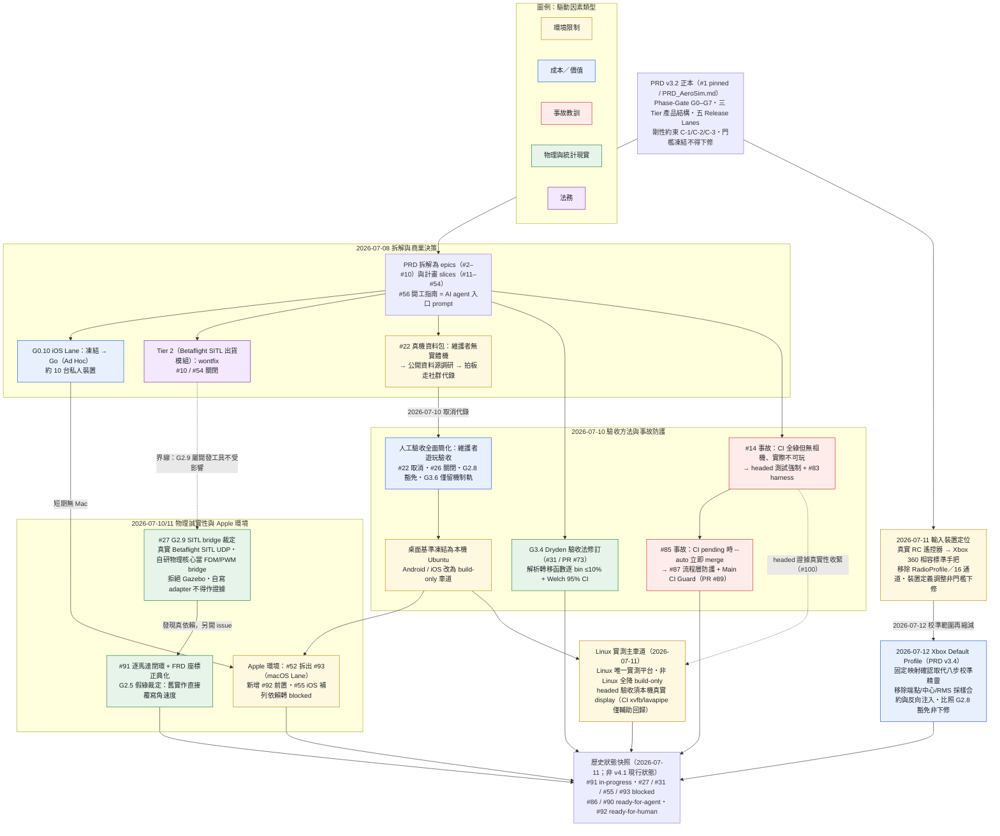

# 開發決策流程 — 從 PRD 初始規劃到目前狀態

本文件是截至 2026-07-11 的**歷史決策流程快照**：記錄 AeroSim 從 PRD v3.2 到 v3.4 的變更。v4.1 publication 後，本文件不再是現行產品或驗收 authority；目前契約以 `PRD_AeroSim.md`、`docs/product_capabilities.md` 與 `docs/decisions/` 為準。

怎麼讀：

- 先看「總覽圖」掌握時間軸與決策節點；每個節點標注驅動因素類型（環境限制／成本／事故教訓／物理與統計現實／法務）。
- 每個節點在下方各有一小節，固定格式：**原計畫 → 變動內容 → 驅動因素 → 紀錄位置**。所有事實均可追溯至 repo 內文件或 GitHub issue/PR；查不到出處的一律標 **not verified**。
- 最後的「治理機制演進」小圖整理流程層規則（TRIAGE 狀態機、#56 閉環規則、合併與測試紀律）如何被事故逐步鍛鍊出來。
- 本專案的鐵律貫穿全部決策：**Phase-Gate 門檻數值核准後凍結、不得下修**（PRD 4.0 閘門總則）。下述所有變動皆屬「驗證方法／存證形式／範圍結構」的調整，每一筆都附有「非門檻下修」的裁定依據。

日期慣例：依來源文件所載日期（維護者裁定留言有時自標次日日期，該留言的 UTC 時間戳一併註明）。

## 總覽圖

## 決策節點

### 0. 起點：PRD v3.2 凍結與 issue 拆解（2026-07-08）

- **原計畫**：PRD v3.2（`PRD_AeroSim.md`，歷經 v2.1 → v3.2 多輪對抗式審查修訂）定義：Phase-Gate G0–G7 剛性閘門、三 Tier 產品結構（Tier 1 自研飛控／Tier 2 Betaflight SITL／Tier 3 PX4 SIH）、五 Release Lanes（WIN／MAC+LIN／Android build-only／iOS 待決策／Tier 2 附屬）、剛性約束 C-1（iOS 禁 subprocess）／C-2（Tier 1 依賴限 MIT/BSD/Zlib/Apache-2.0）／C-3（私下提供仍構成 GPL 散布）。
- **變動內容**：PRD 拆解為 epic issues #2–#10 與計畫型 slices #11–#54（建立於 2026-07-07 22:20 UTC 起），並開 #56「開工指南」作為 AI agent 常設入口 prompt；#1 為 PRD 正本 pinned issue。此後所有變動都以「決策文件 + issue 留言」形式掛回這套骨架。
- **驅動因素**：初始規劃（非變更）。
- **紀錄位置**：`PRD_AeroSim.md`、[#1](https://github.com/jhihweijhan/AeroSim/issues/1)、[#56](https://github.com/jhihweijhan/AeroSim/issues/56)、`.github/TRIAGE.md`。
- 註：PRD 文件屬性欄的「文件狀態」至今為「待核准」字樣，但 #1 明示其為全專案需求正本、門檻凍結執行中——正本地位以 #1 pinned 為準。

### 1. G0.10 iOS Lane：凍結 → Go（Ad Hoc）（2026-07-08）

- **原計畫**：PRD 1.4 將 iOS Lane 列為「凍結，Phase 0 後決策」，G0.10 要求 Go/No-Go 決策文件（LEG 類 Gate）。
- **變動內容**：裁定 **Go，走 Ad Hoc 路線**——目標約 10 台私人裝置（遠低於 Ad Hoc 100 台/年上限）；不採 TestFlight；Enterprise Program 確認不可行（僅限自家員工）。接受成本：Apple Developer 年費 USD 99、UDID 收集重簽、描述檔年度重簽 SOP。#19 關閉，開 #55 追蹤 iOS Lane 打通。
- **驅動因素**：成本／環境限制——TestFlight 有 Apple 審查風險與 build 90 天過期的維運節奏，私人小規模用 Ad Hoc 即足；Enterprise 路線違反協議。
- **紀錄位置**：`docs/decisions/G0.10-ios-lane.md`、[#19](https://github.com/jhihweijhan/AeroSim/issues/19)、[#55](https://github.com/jhihweijhan/AeroSim/issues/55)。
- 後續：2026-07-10 的環境決策（見節點 5）就目前無 Mac／無 iOS 實機的環境覆寫其實機部署動作為 N/A；2026-07-11 #55 補列 #92 依賴轉 `blocked`（見節點 9）。Go 決策本身不變。

### 2. Tier 2（Betaflight SITL 出貨模組）：放棄，wontfix（2026-07-08）

- **原計畫**：PRD Phase 7（G7.1–G7.5）：桌面限定 Betaflight SITL 專業模組，G7.1 法務書面核准為開發前置。
- **變動內容**：維護者決策**放棄 Tier 2 出貨模組**，epic #10 與 slice #54 以 `wontfix` 關閉，理由寫入 `.out-of-scope/tier2-betaflight-sitl.md`。界線澄清：G2.9 SITL 交叉驗證（#27）是開發環境工具、不隨產品發布，不受影響；Tier 3 維持 PRD「後期評估」。未來有明確需求時刪除 out-of-scope 檔並重啟 G7.1 即可。
- **驅動因素**：法務／成本——C-3 明定私下提供仍構成 GPL 散布，每次交付都須履行原始碼義務；聘法務審查 GPL 隔離架構的成本高於小規模私下發行的 Tier 2 價值。
- **紀錄位置**：`.out-of-scope/tier2-betaflight-sitl.md`、[#10](https://github.com/jhihweijhan/AeroSim/issues/10)、[#54](https://github.com/jhihweijhan/AeroSim/issues/54)。

### 3. 真機資料包（#22）：公開資料源 → 社群代錄 → 取消（2026-07-08 → 2026-07-10）

- **原計畫**：PRD 3.6.3／G1.10：5 吋機資料包（台架推力表 + 真機 Betaflight blackbox，分標定組與 holdout 組）作為 G2.8 blackbox 重播與 G3.6(b) propwash 實測殘差的外部真值。
- **變動內容**（三段演進）：
  1. 2026-07-08：維護者無實體 5 吋機，改走公開資料源，調研階段轉 agent 工作。調研結論：無同時滿足 G1.10 技術欄位與 C-2 授權的公開資料源（Tyto 授權未過 C-2；公開 blackbox 多為 GPL 或參數不可考），維護者拍板走「社群／實驗室代錄」（路徑 B）。
  2. 2026-07-10：維護者決策**取消社群代錄**——#22 關閉；**G2.8 整項豁免**（#26 關閉，harness 程式碼保留不刪）；**G3.6 僅保留 (a) 機制軌**，(b) 實測殘差軌豁免（#32 依此調整）。原決策文字所稱「台架推力表已由公開數據庫滿足」不代表現行 G1.10 已具可再發布授權；v4.1 將 G1.10 維持 not verified／blocked，直到 provenance 與 C-2 證據齊備。
  3. 誠實聲明入檔：擬真度自此失去外部真機錨定，僅由解析解、Python Oracle、SITL 趨勢交叉驗證（G2.9）與維護者手感保證；「像真機」宣稱相應收斂。未來取得合規資料可重啟。
- **驅動因素**：環境限制（無真機）＋ 成本（社群發包取消）。
- **紀錄位置**：`docs/decisions/2026-07-10-acceptance-simplification.md`（修訂二）、[#22](https://github.com/jhihweijhan/AeroSim/issues/22)、[#26](https://github.com/jhihweijhan/AeroSim/issues/26)、`docs/research/g1_10_public_data_sources.md`。

### 4. G3.4 Dryden 驗收法修訂（2026-07-10）

- **原計畫**：PRD G3.4 原文：「固定 seed、Welch 法（段長 2¹⁴、50% overlap、Hann 窗）估 PSD，0.1–10 rad/s 各 bin 與理論譜偏差 ≤ 10%（95% 信賴區間內）」。
- **變動內容**：#31 實作中發現單一有限長度隨機實現的 Welch 估計每 bin 有內生統計變異，「每 bin ≤ 10%」對單一實現統計上近乎不可判定（通過與否取決於運氣）。agent 依 fail-loud 停在 draft PR #73 請求裁定；維護者核准替代驗收（兩層）：(1) **解析轉移函數逐 bin ≤ 10%**（確定性判定，嚴格度高於原文）；(2) **Welch 隨機實現落於理論譜 95% CI** 煙霧驗證。三檔全過、同 seed bitwise 一致等不變項照舊。裁定性質：**驗證方法修正，非門檻下修**（10%、頻段、三檔、決定性全數未動）。
- **驅動因素**：物理與統計現實。
- **紀錄位置**：`docs/decisions/G3.4-verification-amendment.md`、[#31](https://github.com/jhihweijhan/AeroSim/issues/31)（2026-07-09 blocked 提問與 2026-07-09T23:52Z 核准留言）、PR [#73](https://github.com/jhihweijhan/AeroSim/pull/73)。

### 5. 人工驗收全面簡化 + 本機 Ubuntu 基準／行動 build-only（2026-07-10）

- **原計畫**：PRD 4.0 Gate 分類要求 DEV-M（錄影＋輸入 log＋build hash＋簽核）與 USR（≥N 名受測者、SUS 問卷、盲測協定）存證。
- **變動內容**：
  - 修訂一：所有 DEV-M 存證與 USR 樣本要求改為**維護者親自安裝、操作、遊玩驗收，於 issue 留言確認**（維護者原話：「不用錄影，社群發包，只要我能操作，玩遊戲這方式來驗証」）。邊界：技術數值門檻不變，可自動量測者（FPS、P99、延遲、尺寸、冷啟動）仍須工具量測附數據——只取代「人工證據形式」與「外部受測者」，不取代量測。
  - 修訂二：取消真機資料包連動豁免（見節點 3）。
  - 修訂三：授權於 self-hosted runner 建置 Betaflight SITL，僅限開發工具鏈（G6.3 掃描仍須 0 GPL）。
  - 環境凍結（同日配套決策文件）：G0.1 正式 gate 僅在本機 Ubuntu 26.04 LTS／Ryzen 9 7945HX／RTX 4060 Ti 成立；Android 與 iOS 為 **build-only 車道**——沒有實機的項目（行動 P99/FPS、OTG、MFi、溫度、crash-free 等）一律 **N/A，不得標示為通過**；iOS 實際 build smoke 在有 macOS/Xcode runner 前為 not verified。
- **驅動因素**：成本（私人小規模發行，正式存證與外部受測不符價值）＋ 環境限制（無行動實機）。
- **紀錄位置**：`docs/decisions/2026-07-10-acceptance-simplification.md`、`docs/decisions/2026-07-10-local-ubuntu-build-only-lanes.md`、PRD「目前環境執行註記（2026-07-10）」。

### 6. #14 事故 → headed 測試強制條款 + #83 harness（2026-07-10）

- **原計畫**：G0.P（可玩垂直切片）為 DEV-M Gate；實作驗收以 headless smoke + CI 綠燈為主要自動化證據。
- **變動內容**：#14 的 Quick Fly 實作（PR #69）CI 全綠、adversarial review 無 Critical/High 後合併，但維護者實際啟動 GUI 驗收判定「**無法玩、無法測試**」——場景無 Camera3D（畫面灰屏）、無視覺參考、Esc 退出無效、arm 流程不可感。退回修正（PR #82 多輪紅綠迭代），並：
  1. 開 #83 建立 **headed 驗收 harness**（零外部依賴：SceneTree 腳本 + `Input.parse_input_event()` 注入 + 逐步截圖 + 斷言「有 active Camera3D、畫面非單色（最大單色佔比 <99%，因為無相機是灰屏 76,76,76 而非黑屏）、操作有可觀察回饋」；CI 用 `xvfb-run -a` + lavapipe，禁用 `DISPLAY=:0`）。
  2. #56 新增強制條款：凡 UI／場景／相機／可玩性類 issue，驗收證據**必須包含 headed 測試**，headless 綠燈不得單獨放行。
  3. Review 盲點修正：可玩類 Gate 的 adversarial review 必須包含人類可見性檢核。
- **驅動因素**：事故教訓——headless 驗證的是邏輯狀態，偵測不到視覺問題；G0.P 的本義是「可玩」。
- **紀錄位置**：[#14](https://github.com/jhihweijhan/AeroSim/issues/14)（2026-07-10T00:05Z 退回留言）、[#83](https://github.com/jhihweijhan/AeroSim/issues/83)、`docs/research/headed-testing-report.md`（實測：harness 直接抓到該事故）、#56 第 4 節。

### 7. #85 事故 → 合併紀律改版 + Main CI Guard（2026-07-10）

- **原計畫**：#56 要求「rebase 最新 main、CI 綠後 squash merge」，實務曾用 `gh pr merge --auto` 讓 GitHub 等 CI。
- **變動內容**：PR #85 在 6 個 CI jobs 仍 pending 時執行 `gh pr merge --squash --auto`，GitHub **立即 merge** 而非建立 auto-merge request——根因：私有 repo + Free 方案無法設 branch protection / required checks（API 403，需 Pro 或轉 public）。維護者裁定不升級、不轉 public，改採**流程層防護**：
  1. #56 明文**禁止 `gh pr merge --auto`**；合併程序改為 `gh pr checks <PR#> --watch --fail-fast` 全綠後才 `gh pr merge --squash`。
  2. 新增 **Main CI Guard** workflow（PR #89）：main post-merge CI 紅燈時自動開 `bug` issue（同 commit 去重），紅燈 main 為最高優先。
  3. 殘餘風險明列（fail loud）：流程層防護依賴 agent 遵守 prompt，非伺服器強制；guard 只能事後偵測。Guard 實際觸發開單一項在 main 首次紅燈前為 not verified。
- **驅動因素**：事故教訓 ＋ 平台限制（GitHub Free 私有 repo）。
- **紀錄位置**：[#87](https://github.com/jhihweijhan/AeroSim/issues/87)（含 2026-07-10T14:04Z 裁定與示範紀錄）、PR [#89](https://github.com/jhihweijhan/AeroSim/pull/89)、`.github/workflows/main-ci-guard.yml`、#56 第 5 節。

### 8. G2.5 假綠 → #91 逐馬達閉環 + FRD 座標正典化（2026-07-10/11）

- **原計畫**：自研飛控以總推力路徑接物理；G2.5「Acro：720°/s 指令峰值角速度誤差 ≤ 5%」由既有測試把關；controller 軸語意沿用 Godot 慣例。
- **變動內容**（#27 實作中發現真依賴，依 TRIAGE 規則另開 #91；三項維護者裁定，留言自標 2026-07-11）：
  1. **逐馬達閉環（#91）**：飛控輸出四馬達指令（Betaflight Quad-X 順序），物理端以同一 hardware preset 的馬達／槳／電池／慣量模型合成力與力矩再積分——取代「直接覆寫角速度」的舊捷徑。
  2. **FRD 正典化**：preset 宣告的 FRD 為正典座標，FRD↔Y-up 僅在單一具名邊界轉換（`(forward, right, down) → (x, z, -y)`）；控制語意採 FRD 標準（roll=繞 F、pitch=繞 R、yaw=繞 D），理由：PRD 明定 rates 與 Betaflight 同名同義；要求紅綠證明（舊測試對新語意先紅、修正後綠），不得靜默改期望值。
  3. **G2.5 時間語意裁定**：舊測試「單一 240 Hz frame 內達 720°/s」是角速度覆寫捷徑下的人工產物，物理上不可能（力矩 ~2.2 Nm／慣量 0.003 kg·m² → 單 frame 上限 ~175°/s），非 PRD 要求——PRD 原文只管追蹤精度不管響應時間。G2.5 語意 = 穩態峰值角速度誤差 ≤ 5%；另加工程時間界線（≤250 ms，附推導）但明標 `test-harness bound, not PRD gate`。舊實作屬假綠，逐馬達閉環才是對此門檻的第一次誠實量測——非門檻下修。
  4. 連帶治理條款（#56）：**門檻出處紀律**——測試數值在 PRD 找不到出處者必須明標 test-harness bound 並附推導；發現「PRD 門檻與物理互斥」時停下請維護者裁定，不得自行改測試期望值。
- **驅動因素**：物理現實（測試期望物理上不可能）＋ 事故教訓（假綠）。
- **紀錄位置**：[#91](https://github.com/jhihweijhan/AeroSim/issues/91)（body 與 2026-07-10T21:37Z／21:45Z 裁定留言）、[#27](https://github.com/jhihweijhan/AeroSim/issues/27)（2026-07-10T20:59Z 另開 issue 裁定）、#56 第 4 節。

### 9. G2.9 SITL bridge 兩項架構裁定（#27，2026-07-10/11）

- **原計畫**：G2.9 = 同輸入餵自研飛控與 Betaflight SITL，姿態趨勢相關係數 ≥ 0.85（開發工具，非 Tier 2）。實作細節（SITL 從哪來、物理端誰當 bridge）未定。
- **變動內容**（兩項裁定 + 前置授權）：
  1. **證據純度**：必須用**真實 Betaflight SITL**（原生 UDP 封包，FDM in／servo out）；自寫 reference adapter 僅可作框架自測 fixture，**永不得作為 G2.9 證據來源**；報告須含 SITL binary 的版本/commit/協定證據。前置授權：於 self-hosted runner clone 並建置 Betaflight SITL，僅限開發工具鏈（2026-07-10 決策修訂三）。
  2. **Bridge 選型**：用 **AeroSim 自研物理核心**作 FDM/PWM bridge，**不引入 Gazebo**——兩個閉環共用同一套物理，唯一變因是飛控，相關係數語意最乾淨；且不在 headless runner 上裝整套模擬器（法務上 dev-only 使用 GPL 零義務，純工程考量）。
  3. 連帶發現逐馬達真依賴 → #91（見節點 8），#27 轉 `blocked` 停放。
- **驅動因素**：比對純度（物理與統計現實）＋ 依賴成本。
- **紀錄位置**：[#27](https://github.com/jhihweijhan/AeroSim/issues/27)（2026-07-09T23:52Z 授權、2026-07-10T20:46Z／20:54Z 兩項裁定留言）、`docs/decisions/2026-07-10-acceptance-simplification.md`（修訂三）。

### 10. Apple 建置環境：#52 拆出 macOS Lane、iOS 補列依賴（2026-07-11，留言 2026-07-10T22:13–22:23 UTC）

- **原計畫**：#52（發行工件與交付 SOP）涵蓋 Win/macOS/Linux/Android 四平台安裝包；#55（iOS Lane）依 G0.10 Go 決策推進。
- **變動內容**：接手 #52 的 agent 發現 macOS 安裝包需要真實 macOS export 環境，但 repo 只有 Linux self-hosted runner——fail loud 轉 `blocked` 請維護者裁定（三選項）。維護者裁定**選項 3**：
  1. **#93**（新）：macOS Lane 發行工件獨立成票，G6.1 macOS 分支門檻**原封移轉**（非下修），blocked on #92。
  2. **#92**（新，`ready-for-human`）：Apple 建置環境（Mac 取得、Xcode、Developer Program、簽章/公證、macOS runner）——maintainer 硬體/帳號作業，同時是 iOS Lane 前置。
  3. **#55** 補列 #92 為真依賴，轉 `blocked`（iOS Go 決策不變）。
  4. **#52** 範圍縮為 SC + Windows/Linux/Android 三 Lane，續作。依 PRD 1.4「Release Lanes 獨立不互擋」，此為結構調整非門檻下修。
- **驅動因素**：環境限制——維護者短期無 Mac。
- **紀錄位置**：[#52](https://github.com/jhihweijhan/AeroSim/issues/52)（2026-07-10T22:15Z 三選項提問與 22:23Z 裁定留言）、[#92](https://github.com/jhihweijhan/AeroSim/issues/92)、[#93](https://github.com/jhihweijhan/AeroSim/issues/93)、[#55](https://github.com/jhihweijhan/AeroSim/issues/55)。

### 11. Linux 實測主車道：非 Linux 全面 build-only + headed 驗收須真實 display（2026-07-11）

- **原計畫**：節點 5 的 2026-07-10 決策將 build-only 車道限於 Android／iOS 行動平台；headed 測試強制（節點 6）要求 UI／可玩類 gate 驗收含 headed 測試、headless 綠燈不得單獨放行，但**未明訂 headed 證據的執行環境**（CI xvfb-smoke 或本機真實 display）。
- **變動內容**（`2026-07-11-linux-primary-acceptance.md`，含 2026-07-11 headed 補充裁定 #100）：
  1. **Linux 為唯一實測平台**：所有 runtime／遊戲性／效能／操作類 gate 的實測證據只在 Linux（G0.1 凍結之本機 Ubuntu）取得；固定序列「自動化 → Godot headed → 維護者遊玩驗收」，不得跳關。
  2. **非 Linux 平台全面降 build-only**：Windows／macOS／Android／iOS 驗收 = source build／export 成功 ＋ 既有 CI 自動測試；平台專屬實測 gate 一律 **N/A（未驗證凍結）**，不得標 pass——將節點 5 的行動 build-only 邊界推廣至所有非 Linux 平台。
  3. **headed 驗收須本機真實 display（2026-07-11 補充，#100）**：headed 測試必須在本機真實 display 執行、**遊戲畫面實際彈出、維護者能親眼看到才算 headed 證據**；CI 的 xvfb／lavapipe headed-smoke 僅為自動化輔助回歸，**不得充當 headed 驗收證據**——是節點 6 headed 強制條款在「證據真實性」上的再收緊。
  - 門檻**數值**一律不變，屬驗收平台範圍與證據形式調整（PRD 1.4 Lane 獨立結構）。
- **驅動因素**：環境限制（無非 Linux 實機／實測環境）＋ 事故教訓（#14：headless／非目視證據偵測不到視覺問題）。
- **紀錄位置**：`docs/decisions/2026-07-11-linux-primary-acceptance.md`、PRD 變更紀錄「v3.2 修訂（2026-07-11）」、[#52](https://github.com/jhihweijhan/AeroSim/issues/52)、[#93](https://github.com/jhihweijhan/AeroSim/issues/93)、#100（headed 補充）。

### 12. 輸入裝置定位：真實 RC 遙控器 → Xbox 360 相容標準手把（2026-07-11）

- **原計畫**：PRD 將輸入裝置定為真實 RC 遙控器（RadioMaster／FrSky USB，16 通道），輸入 Profile 含 RadioProfile；G0.5、G4B.UI2、G5.1／G5.2／G5.6 以 16 通道／RC 實機為驗收判準。
- **變動內容**：輸入裝置定位改為 **Xbox 360 相容的一般 USB／藍牙 game 手把**；移除 RadioProfile 與 16 通道需求，輸入 Profile 縮為 GamepadProfile + KeyboardProfile（鍵盤僅 fallback）。上述各 Gate 改以「Xbox 360 相容手把」判準，**數值門檻不變**（校準時限、延遲 ms、顯示即時性，及 G5.4 端到端延遲桌面 ≤40ms 皆維持原值，量測對象改為標準手把鏈路），變更的是「受測裝置類別」——與 2026-07-11 Linux 實測主車道同屬「驗收範圍／裝置定義調整」，依 PRD 1.4 結構成立，**非門檻數值下修**。RC 遙控器支援若未來出現真實需求（客戶指名＋取得實機），以新增 Profile 方式回補，不需修改既有門檻。
- **驅動因素**：環境限制（維護者手邊無 RC 遙控器實機，RC 專屬驗收在 Linux 實測主車道下永遠無法誠實取證）＋ 產品定位（目標使用情境即以標準手把遊玩，RC 定位屬過度工程）。
- **紀錄位置**：`docs/decisions/2026-07-11-standard-gamepad-input.md`、`PRD_AeroSim.md` v3.3 變更紀錄（PR #101）、同步 issues [#1](https://github.com/jhihweijhan/AeroSim/issues/1)／[#8](https://github.com/jhihweijhan/AeroSim/issues/8)／[#40](https://github.com/jhihweijhan/AeroSim/issues/40)／[#41](https://github.com/jhihweijhan/AeroSim/issues/41)／[#48](https://github.com/jhihweijhan/AeroSim/issues/48)／[#56](https://github.com/jhihweijhan/AeroSim/issues/56)。

### 13. Xbox Default Profile：固定映射確認取代校準精靈（PRD v3.4，2026-07-12）

- **原計畫**：延續節點 12（Xbox 360 相容標準手把）後，PRD 3.5.4 仍要求八步 Controller Setup Flow（偵測 → live monitor → 四軸指派 → 端點校準 → 反向偵測 → arm/mode 映射 → 油門低位檢查 → 測試懸停台）與六項「校準驗收合約」（端點覆蓋 ≥95%、中心偏移 ≤±2%、靜置 RMS ≤0.5%、反向可注入測試等），全數通過才寫入 `CalibrationProfile`。
- **變動內容**：以**固定、版本化的 Xbox 360 相容手把映射**取代八步校準精靈——偵測相容手把（`Input.is_joy_known()`，SDL mapping 存在）→ 確認畫面（顯示固定映射與四軸即時值，漂移肉眼可見）→ 玩家確認 → 建立 session `GamepadProfile` → preflight；unknown 裝置明確提示不支援＋keyboard fallback，禁止套用 Xbox 映射。**移除**端點/中心/RMS 採樣合約、反向注入測試與 `CalibrationProfile` 採樣持久化；**保留**固定 deadzone（具名常數，raw 軸 0.08–0.10 定值，寫入 profile schema）、Arm/Mode 去抖 ≤50 ms、油門低位為 arm 前置、unknown 裝置 100% 擋下（注入測試，取代原反向注入）。PRD G4B.3／G4B.UI1／G4B.UI2／G5.5／G5.6 措辭連動改寫，**門檻數值（30/90 秒、30 Hz、50 ms）不變**；性質為**需求範圍縮減**，比照 G2.8 豁免先例明文記錄，非靜默下修。風險（固定映射不偵測硬體不良：中心漂移/端點磨損/雜訊超標）由維護者接受，緩解為固定 deadzone + 確認畫面即時值 + preflight Throttle low 狀態燈。`docs/gamepad-calibration-contract.md` 標 SUPERSEDED，保留作審計軌跡。
- **驅動因素**：成本／價值（維護者裁定「需求簡化」——標準手把布局由 SDL mapping 保證唯一性，逐軸校準屬過度工程）＋ 產品定位（延續節點 12，目標即手把玩家）。
- **紀錄位置**：`docs/decisions/2026-07-12-xbox-default-profile.md`、`PRD_AeroSim.md` v3.4 變更紀錄（PR #112）、`docs/gamepad-calibration-contract.md`（SUPERSEDED 註記）、對應 issues [#40](https://github.com/jhihweijhan/AeroSim/issues/40)（主）／[#41](https://github.com/jhihweijhan/AeroSim/issues/41)／[#49](https://github.com/jhihweijhan/AeroSim/issues/49)。

## 治理機制演進

流程層規則不是一次設計好的，而是被事故逐步鍛鍊出來的：

```mermaid
flowchart LR
    subgraph TR["TRIAGE 狀態機（.github/TRIAGE.md）"]
        direction TB
        TR1["初版：標準五態 + blocked 擴充<br/>epic / documentation 不進狀態機"]
        TR2["2026-07-09：blocked 誤用修正<br/>新增 in-progress（draft PR 持有成果，續作不重派）"]
        TR3["2026-07-10：實作中三種發現規則<br/>沒做完→in-progress・真依賴→寫入 Blocked by<br/>新缺陷→開新 bug 不擴大原 issue"]
        TR1 --> TR2 --> TR3
    end

    subgraph AG["#56 多 agent 閉環規則"]
        direction TB
        AG1["2026-07-08 初版：硬編起點編號"]
        AG2["2026-07-08：改依 ready-for-agent label 查詢<br/>認領前查既有 PR/branch・Closes 與 Refs 區分"]
        AG3["2026-07-10：原子認領 + 24h 接手時鐘<br/>僅計 claim 者本人活動，他人留言不重置<br/>（#31 / #27 逾時接手首例）"]
        AG4["2026-07-10/11：檔案重疊三分法<br/>活躍→跳過・逾時→接手・停放（blocked）→不構成否決<br/>幽靈 draft PR 不得封鎖佇列"]
        AG1 --> AG2 --> AG3 --> AG4
    end

    subgraph CI["合併與測試紀律"]
        direction TB
        CI1["初版：CI 綠 + adversarial review → squash merge"]
        CI2["2026-07-10：headed 測試強制（#14 事故）<br/>UI/可玩類 issue headless 綠燈不得單獨放行"]
        CI3["2026-07-10：禁止 --auto（#85/#87 事故）<br/>gh pr checks --watch 全綠才 merge + Main CI Guard"]
        CI4["2026-07-11：門檻出處紀律（G2.5 假綠）<br/>非 PRD 數值明標 test-harness bound 並附推導"]
        CI5["2026-07-11：headed 驗收證據須本機真實 display（#100）<br/>CI xvfb/lavapipe headed-smoke 僅輔助回歸，不充當驗收證據"]
        CI1 --> CI2 --> CI3 --> CI4 --> CI5
    end
```

補充脈絡：

- **in-progress 的由來**：#31/#27 曾在「工作沒做完」時被誤貼 `blocked`，2026-07-09 狀態修正留言指出這是「狀態詞彙缺口的誤用」，`in-progress` 隨後收錄進 TRIAGE.md。
- **檔案重疊三分法的由來**：2026-07-10 一輪佇列掃描中，agent 因與**停放中**（issue 為 blocked）的 draft PR #73/#77/#79 檔案重疊而跳過了 #18/#36/#42/#86 等全部候選——維護者裁定此為誤用規則（停放 PR 不構成否決、維護者裁定留言不重置接手時鐘），#56 據此明文化三分法，並寫入「幽靈 draft PR 不得封鎖佇列」。
- **24h 接手時鐘首例**：draft PR #73（#31）與 #77（#27）於 2026-07-10T14:57Z 稽核認定逾時（最後 commit 逾 24 小時且無 claim 者本人活動），由新 agent 留言宣告接手、接續既有 branch 完成，不砍掉重練。
- **裁定請求格式**：#56 要求 blocked 提問附「白話說明 + 編號選項 + 建議與理由」——節點 4（G3.4）、9（G2.9）、10（macOS 三選項）都是這個格式的實例。

## 歷史狀態快照（2026-07-11；非 v4.1 現行狀態）

| Issue | 狀態 | 說明 |
|---|---|---|
| [#91](https://github.com/jhihweijhan/AeroSim/issues/91) 逐馬達閉環 | `in-progress` | native suite 已綠（含 FRD 紅綠證據、1 kHz 飽和 latch），續作 replay/效能/headed 證據 |
| [#27](https://github.com/jhihweijhan/AeroSim/issues/27) G2.9 SITL 交叉驗證 | `blocked` | 等 #91；PR #77 停放 |
| [#31](https://github.com/jhihweijhan/AeroSim/issues/31) 風場系統 | `blocked` | 等 #90；PR #73 停放 |
| [#86](https://github.com/jhihweijhan/AeroSim/issues/86) A5 下洗未接入雙機模擬 | `ready-for-agent` | #17 adversarial review 發現的既有缺口 |
| [#90](https://github.com/jhihweijhan/AeroSim/issues/90) A3 阻力未接 hardware runtime | `ready-for-agent` | PR #73 adversarial review 發現的既有缺口 |
| [#92](https://github.com/jhihweijhan/AeroSim/issues/92) Apple 建置環境 | `ready-for-human` | 維護者硬體/帳號作業 |
| [#93](https://github.com/jhihweijhan/AeroSim/issues/93) macOS Lane 發行工件 | `blocked` | 等 #92 |
| [#55](https://github.com/jhihweijhan/AeroSim/issues/55) iOS Lane 打通 | `blocked` | 等 #92（Go 決策不變） |
| [#52](https://github.com/jhihweijhan/AeroSim/issues/52) 發行工件與交付 SOP | `in-progress` | 已縮為 Win/Linux/Android 三 Lane |

（狀態快照時間：2026-07-11；即時狀態以 GitHub labels 為準。）

## Not verified 事項（本文件範圍內）

- **iOS 實際 Xcode build smoke**：在 macOS/Xcode runner 可用前為 not verified（`docs/decisions/2026-07-10-local-ubuntu-build-only-lanes.md`）。
- **Main CI Guard 實際觸發開單**：需 main 首次紅燈才可驗證（#87 關閉留言明列）。
- **行動實機類門檻**（行動 P99/FPS、OTG、MFi、溫度、crash-free 等）：一律 N/A，非 pass。
- **PRD「文件狀態：待核准」欄位**：未見正式核准紀錄；實務上以 #1 pinned 為正本執行（見節點 0 註）。
