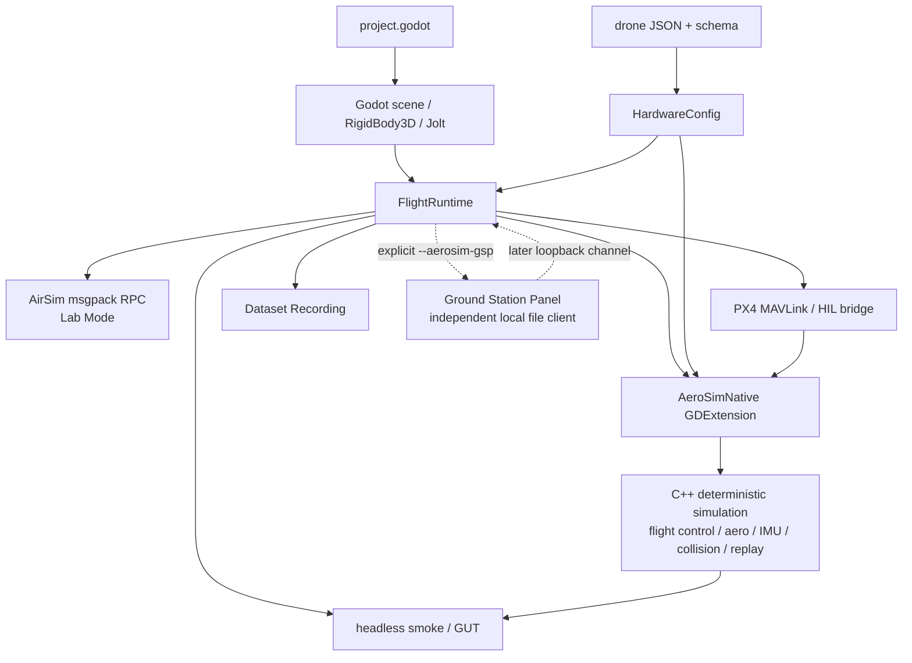
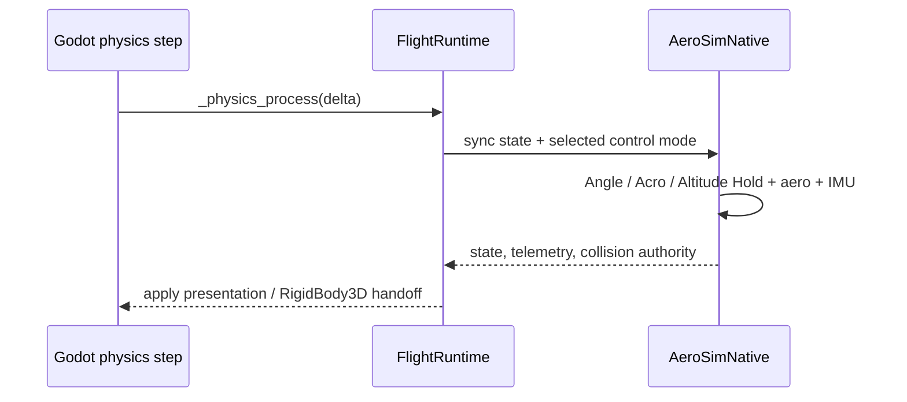
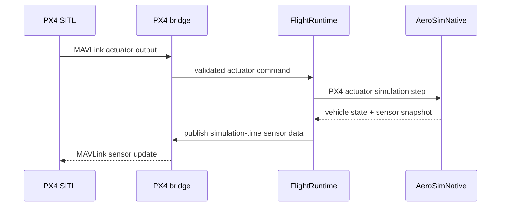
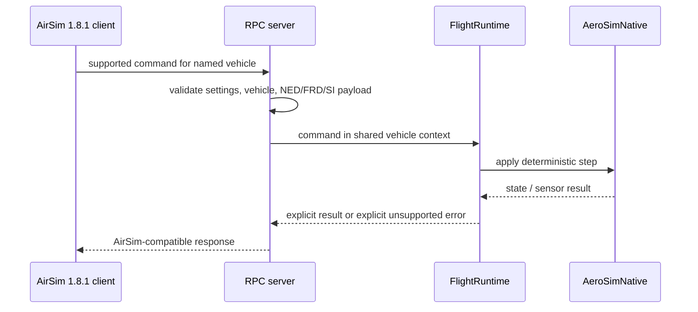
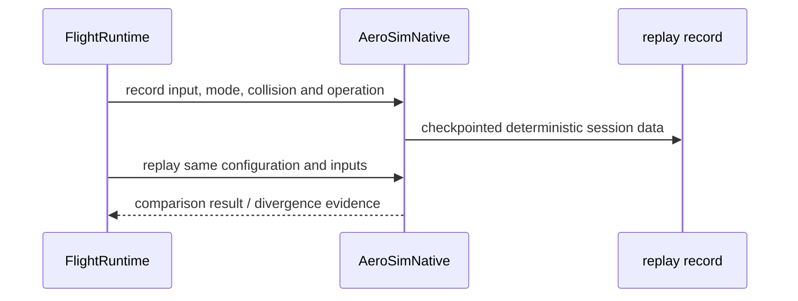

# AeroSim 運行時架構

Godot 擁有場景、Jolt 碰撞與呈現；原生 C++ 核心擁有確定性飛行、控制、感測器與重播。
兩者由 GDExtension 與 `FlightRuntime` 連接；`FlightRuntime` 是 composition root，不是純 UI。

## 擁有權與資料流

| 層 | 擁有什麼 | 不應擁有什麼 |
| --- | --- | --- |
| Godot scene / Jolt | Node3D、RigidBody3D、collision contact、camera、UI、reference environment 的呈現。 | 對外座標約定與 deterministic flight truth。 |
| FlightRuntime | 組合 Godot、native、input、config、AirSim、PX4 與 replay 的時序。 | 把 flight core 複製成 GDScript。 |
| AeroSimNative | simulation integration、flight controller、aerodynamics、IMU、collision authority handoff、telemetry、replay。 | Godot scene graph 與 UI。 |
| HardwareConfig + drone JSON | 機體物理與硬體參數的來源與驗證。 | 任意 runtime hard-coded airframe constants。 |
| AirSim / PX4 adapters | 把 external command、sensor payload、actuator output 轉進同一 runtime/vehicle context。 | 繞過 public coordinate contract 直接操作 Godot axes。 |
| Ground Station Panel (GSP) | 明確啟用後，以獨立、自包含的本機 `file://` panel bundle 補充開發調參與後續 telemetry/replay 工作。 | 不取代 Godot 內的 Operations Dashboard，也不在未啟用時啟動。 |

### GSP 與 Operations Dashboard 的邊界

Operations Dashboard 是 Godot 內的 operator-facing UI：它跟著 Player/Lab Mode、同一個
simulation session 與 native authority，負責 vehicle、telemetry、sensor、recording 與
environment 的狀態操作。GSP 是 development-only 的第二個 native Wayland client，供 paused、
post-flight 或 second-screen tuning 使用；它由 `--aerosim-gsp` 明確啟用，啟用時才安裝並
開啟本機 panel bundle。GSP 不建立第二份 simulation、telemetry、coordinate 或 replay
authority。

安裝單位是 bundle 而不是單一檔案：`install_panel()` 對 `gsp_panel.html` 與
`PANEL_ASSET_PATHS` 列出的每個 packaged asset 一起計算 SHA-256，寫進暫存目錄後以一次
rename 發佈成 `gsp/bundle-<hash>/`，內含 `panel.html` 與 `assets/`。任何 packaged asset
缺席都讓安裝直接失敗，不會退回半套 bundle；`tests/headless/gsp_launch_contract.gd` 會驗證
launcher 回報的 panel path 位於 `bundle-` 目錄且 `assets/gsp_visual.js` 存在。bundle 內的
Three.js 是釘住版本並記錄 SHA-256 的 vendored 副本，attribution 與範圍寫在
`third_party/licenses.json`；panel 不在執行期抓取遠端資源。

panel 的視覺化元素都是 presenter，不是新的真相來源：程序化 Quad-X 檢視、硬體設定與
derived power model 檢視、完整 telemetry 傾印，全部只讀同一份
`FlightRuntime.gsp_telemetry_snapshot()` payload，沿用既有的 NED／FRD／SI 表述。3D 檢視
不做物理積分，rotor 動畫只依 telemetry 的 motor speed 與 `spin_direction` 呈現。

GSP 的瀏覽器開啟是 best-effort：Wayland 不允許應用程式強迫另一個應用程式取得焦點，因此
啟動時的自動開啟不能當成面板已顯示的證據。當 GSP server 已啟動且 launcher 保有這次執行的
panel URL 時，暫停選單會額外出現 `OPEN GSP PANEL`、`COPY GSP URL` 兩個使用者觸發的入口與
一個狀態標籤；GSP 未啟用或尚未就緒時，這三個控制項完全不建立。狀態標籤只顯示請求成功或
不可用，帶 session token 的 URL 不會出現在 HUD。這些控制項屬於 paused／post-flight 的
workstation 入口，不改變飛行中的控制路徑。

## 四個重要時序

### 1. 內建 flight-controller tick

### 2. PX4 lockstep tick

### 3. AirSim command

### 4. Flight Replay

## Contract Atlas

| 契約 | 白話用途 | 擁有者 | 權威來源 | 證據與驗證 | 狀態 |
| --- | --- | --- | --- | --- | --- |
| External Coordinate Contract | 所有 public spatial payload 只用 NED／FRD／SI；Godot Y-up 留在內部。 | coordinate contract module | `common/rpc/airsim_coordinate_contract.gd`、ADR 0011 | coordinate contract GUT fixtures | Confirmed target |
| GDScript ↔ native boundary | Godot 透過註冊的 `AeroSimNative` methods 操作原生核心。 | GDExtension binding | `src/native/register_types.cpp`、`src/native/aerosim_native.cpp` | native binding、headless smoke | Foundation |
| airframe configuration | JSON/schema 參數同時驅動 Godot runtime 與 native models。 | HardwareConfig | `config/drone_schema.json`、`config/drones/`、`common/flight/hardware_config.gd` | hardware configuration native tests | Foundation |
| AirSim / PX4 boundary | AirSim command 與 PX4 actuator 都進同一 vehicle/runtime context。 | RPC server / PX4 bridge | `common/rpc/airsim_rpc_server.gd`、`common/rpc/px4_sitl_bridge.gd`、compatibility manifest | RPC、PX4 bridge、coordinate tests | Confirmed target |
| Sensor Timebase | sensor timestamp 只取 simulation time；pause 不會偷走時間。 | AirSimSession / sensor suite | `common/rpc/airsim_session.gd`、`common/rpc/airsim_sensor_suite.gd` | sensor rate、pause 與 deterministic fixture tests | Confirmed target |
| Replay / Dataset boundary | replay 重建控制與條件；dataset 保留時間對齊觀測，兩者不可互稱。 | native replay / recording pipeline | `src/native/aerosim_native.cpp`、`docs/dataset_recording.md` | replay integration 與 dataset validation | Foundation / Confirmed target |

## 改動後跑什麼

| 改動範圍 | 先讀 | 首選驗證 |
| --- | --- | --- |
| native flight / aero / collision / IMU / replay | native core 與 hardware config | `tests/native/test_*.cpp`、`scripts/test_native.sh` |
| Godot ↔ GDExtension boundary | FlightRuntime、AeroSimNative binding | headless smoke |
| AirSim / PX4 / coordinates | coordinate contract、RPC server、PX4 bridge | 對應 GUT 與 headless integration harness |
| Free Flight 地圖場景與視覺資產 | `levels/free_flight/` 的場景，以及 `assets/third_party/terrain3d/asset_notes.md` 記錄的 write boundary：third-party terrain 目錄為唯讀，authoring pass 只寫入 `assets/maps/terrain3d_range/data/` | `tests/headless/terrain3d_range_smoke.gd`、`tests/headless/industrial_yard_renderer_smoke.gd`（兩者除結構外，也檢查可見 Kenney 資產每個 surface 都帶 albedo texture）；`scripts/check_third_party_terrain_integrity.py` 在 CI 內把 vendored region 對照 asset_notes.md 記錄的 SHA-256，編輯器重存造成的位元改寫會讓 build 失敗 |
| Linux 綜合 gate | CI 與驗收規則 | `scripts/verify_issue_11.sh` |
