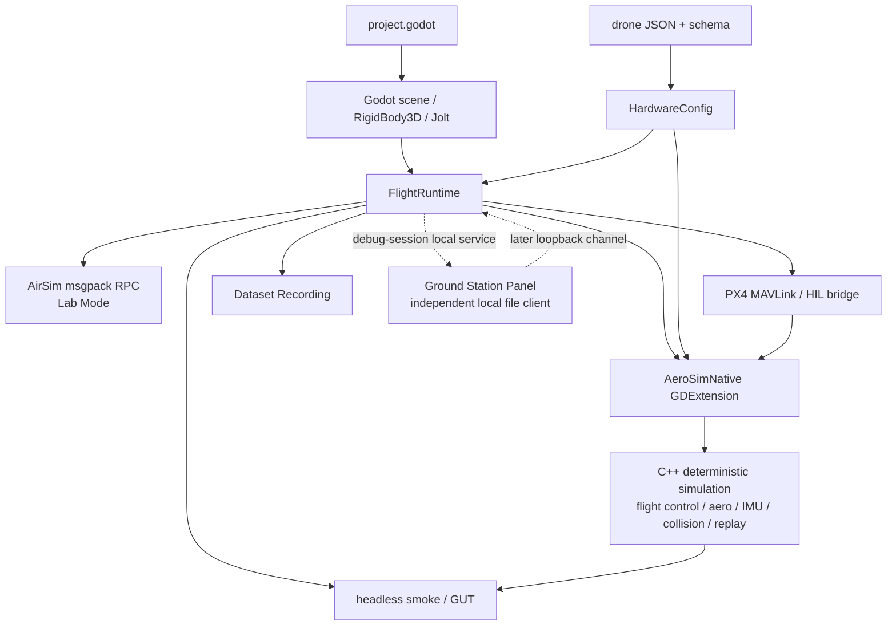
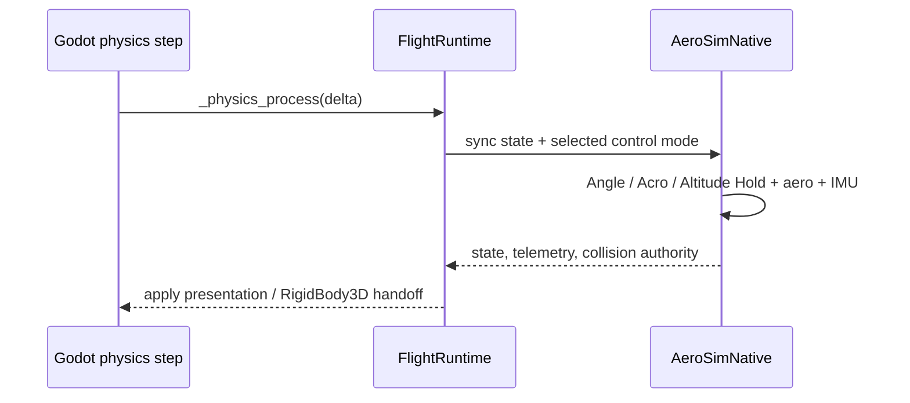
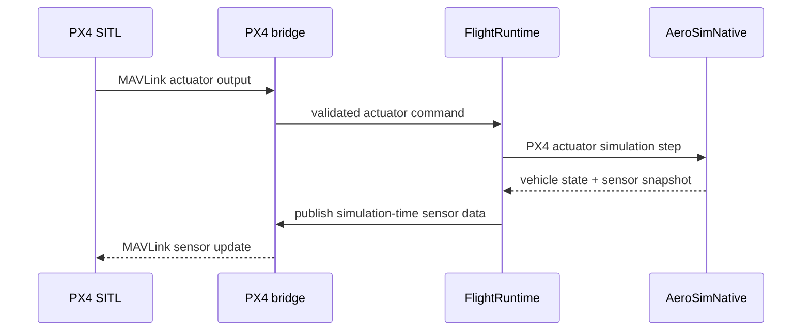
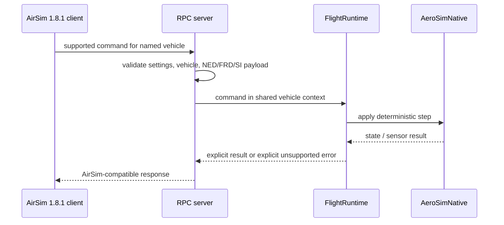
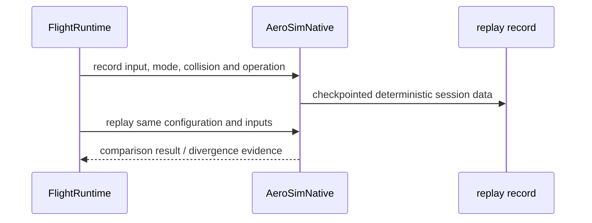

# AeroSim 運行時架構

Godot 擁有場景、Jolt 碰撞與呈現；原生 C++ 核心擁有確定性飛行、控制、感測器與重播。
兩者由 GDExtension 與 `FlightRuntime` 連接；`FlightRuntime` 是 composition root，不是純 UI。

## 擁有權與資料流

| 層 | 擁有什麼 | 不應擁有什麼 |
| --- | --- | --- |
| Godot scene / Jolt | Node3D、RigidBody3D、collision contact、camera、UI、reference environment 的呈現。 | 對外座標約定與 deterministic flight truth。 |
| FlightRuntime | 組合 Godot、native、input、config、AirSim、PX4 與 replay 的時序。 | 把 flight core 複製成 GDScript。 |
| AeroSimNative | simulation integration、flight controller、aerodynamics、IMU、collision authority handoff、telemetry、replay。 | Godot scene graph 與 UI。 |
| HardwareConfig + drone JSON | 機體物理與硬體參數的來源與驗證。 | 任意 runtime hard-coded airframe constants。 |
| AirSim / PX4 adapters | 把 external command、sensor payload、actuator output 轉進同一 runtime/vehicle context。 | 繞過 public coordinate contract 直接操作 Godot axes。 |
| Ground Station Panel (GSP) | 在 debug build 的 session 內，以獨立、自包含的本機 `file://` panel bundle 補充開發調參與後續 telemetry/replay 工作。 | 不取代 Godot 內的 Operations Dashboard，也不在 release build 啟動。 |

### GSP 與 Operations Dashboard 的邊界

Operations Dashboard 是 Godot 內的 operator-facing UI：它跟著 Player/Lab Mode、同一個
simulation session 與 native authority，負責 vehicle、telemetry、sensor、recording 與
environment 的狀態操作。GSP 是 development-only 的第二個 native Wayland client，供 paused、
post-flight 或 second-screen tuning 使用；debug session 啟動時會建立本機服務與
`common/gsp/gsp_panel.html` 的副本，暫停選單的使用者動作才開啟面板。GSP 不建立第二份 simulation、telemetry、
coordinate 或 replay authority。

GSP 沒有啟動參數：`GspLauncher` 會在使用者操作時建立本機服務並安裝
bundle，但不會自動開啟瀏覽器。Wayland 不允許應用程式強迫另一個應用程式取得焦點，因此
面板一律由使用者動作開啟。只要 runtime 掛著 `GspLauncher`，暫停選單就會建立
`OPEN GSP PANEL`、`COPY GSP URL` 兩個入口與一個狀態標籤；本機服務尚未就緒時這些控制項
仍然存在，按下時才即時嘗試啟動。狀態標籤只顯示就緒、不可用、已送出開啟請求或已複製網址，
帶 session token 的 URL 不會出現在 HUD。這些控制項屬於 paused／post-flight 的 workstation
入口，不改變飛行中的控制路徑。

### GSP `即時狀態` 與風場授權

CAP-024 之後，GSP 的直式 `即時狀態` 表面在 Lab Mode 是 Available：它把 previewed／applied 風場、
Vehicle Instance 反應、PX4 estimate 與 target、M1–M4 normalized post-allocation command 與
模擬 measured motor feedback 放在同一條可檢視的因果鏈上。每個可見數值都標示 Commanded、
Ground truth、Estimated 或 Measured 來源類別與新鮮度；過時或不可用的樣本保留最後值並明示
unavailable，不得以零值或 AeroSim 本地估測冒充 PX4。

風場只能由 authenticated 的明確 apply 改變環境，不會由預覽動作生效。`FlightRuntime` 把待處理的
GSP 風場請求排到下一個 authoritative physics tick 才套用，並要求 native replay 回傳帶
`physics_tick` 與 `event_order` 的 environment event identity；對不上時 replay recording 直接
fail loud，而不是靜默記錄。PX4 High Fidelity 只在輸出新鮮時保有獨占 authority，過時即 fail
closed，不隱式回退到內建 controller。

CAP-006 尚未通過，因此上述表面的視覺與可用性證據仍是 provisional Codex AI visual evidence，
不是人工核准的 UI 審核。

### 機體軸與呈現層對齊

runtime 內部的機體約定是 **+X forward、+Z right、+Y up**，而 Godot `Camera3D` 沿 local −Z
看。兩者的差異只在呈現層的單一常數（`FPV_CAMERA_BODY_ALIGNMENT`）處理，主／副 FPV 相機
共用同一個轉換，不各自翻軸。這與對外的 NED／FRD 契約是兩件事：這裡只描述 Godot 內的
camera 與模型擺放。

| 呈現元素 | 對齊規則 | 證據 |
| --- | --- | --- |
| FPV（主／副 chase camera） | 先轉進機體約定，再套用飛行員設定的 camera angle。 | `test_player_cameras_align_with_the_frd_forward_axis` |
| 第三人稱相機 | 位於機體 −X 後上方，且只跟隨水平朝向；機體 pitch／roll 不會讓它繞著飛機轉，機體接近垂直時退回由 +Z right 推得的水平朝向。 | `test_third_person_camera_does_not_orbit_with_body_pitch`、headless smoke 的 body-frame offset 檢查 |
| 匯入的機體模型 | 機鼻對齊機體 +X。模型 AABB 由四支外伸機臂主導，不是機鼻方向的證據；以 nose 側的頂點密度判定。 | `test_imported_drone_nose_aligns_with_the_frd_forward_axis` |

FPV 的 camera angle 與 FOV 由 `config/drones/*.json` 的 `fpv` 區塊與 `HardwareConfig` 出廠
預設提供，並且飛行中可由 camera 面板調整。`Camera3D.fov` 在預設 `keep_aspect = KEEP_HEIGHT`
下是**垂直** FOV，因此設定值不可當成水平視角讀。目前出廠預設與 `5_inch_6s` 是 camera angle
0°、vertical FOV 90°，`5_inch_6s_race` 維持 45° 傾角。

## 四個重要時序

### 1. 內建 flight-controller tick

### 2. PX4 lockstep tick

### 3. AirSim command

### 4. Flight Replay

## Contract Atlas

| 契約 | 白話用途 | 擁有者 | 權威來源 | 證據與驗證 | 狀態 |
| --- | --- | --- | --- | --- | --- |
| External Coordinate Contract | 所有 public spatial payload 只用 NED／FRD／SI；Godot Y-up 留在內部。 | coordinate contract module | `common/rpc/airsim_coordinate_contract.gd`、ADR 0011 | coordinate contract GUT fixtures | Confirmed target |
| GDScript ↔ native boundary | Godot 透過註冊的 `AeroSimNative` methods 操作原生核心。 | GDExtension binding | `src/native/register_types.cpp`、`src/native/aerosim_native.cpp` | native binding、headless smoke | Foundation |
| airframe configuration | JSON/schema 參數同時驅動 Godot runtime 與 native models。 | HardwareConfig | `config/drone_schema.json`、`config/drones/`、`common/flight/hardware_config.gd` | hardware configuration native tests | Foundation |
| AirSim / PX4 boundary | AirSim command 與 PX4 actuator 都進同一 vehicle/runtime context。 | RPC server / PX4 bridge | `common/rpc/airsim_rpc_server.gd`、`common/rpc/px4_sitl_bridge.gd`、compatibility manifest | RPC、PX4 bridge、coordinate tests | Confirmed target |
| Sensor Timebase | sensor timestamp 只取 simulation time；pause 不會偷走時間。 | AirSimSession / sensor suite | `common/rpc/airsim_session.gd`、`common/rpc/airsim_sensor_suite.gd` | sensor rate、pause 與 deterministic fixture tests | Confirmed target |
| Replay / Dataset boundary | replay 重建控制與條件；dataset 保留時間對齊觀測，兩者不可互稱。 | native replay / recording pipeline | `src/native/aerosim_native.cpp`、`docs/dataset_recording.md` | replay integration 與 dataset validation | Foundation / Confirmed target |

## 改動後跑什麼

| 改動範圍 | 先讀 | 首選驗證 |
| --- | --- | --- |
| native flight / aero / collision / IMU / replay | native core 與 hardware config | `tests/native/test_*.cpp`、`scripts/test_native.sh` |
| Godot ↔ GDExtension boundary | FlightRuntime、AeroSimNative binding | headless smoke |
| 玩家相機、機體模型擺放與 FPV 預設 | 本頁「機體軸與呈現層對齊」、`common/flight/camera_profile.gd`、`common/flight/drone_visual_loader.gd` | `tests/gut/test_flight_runtime_load.gd` 的相機與機鼻對齊測試、headless smoke 的 body-frame offset 檢查 |
| AirSim / PX4 / coordinates | coordinate contract、RPC server、PX4 bridge | 對應 GUT 與 headless integration harness |
| Free Flight 地圖場景與視覺資產 | `levels/free_flight/` 的場景，以及 `assets/third_party/terrain3d/asset_notes.md` 記錄的 write boundary：third-party terrain 目錄為唯讀，authoring pass 只寫入 `assets/maps/terrain3d_range/data/` | `tests/headless/terrain3d_range_smoke.gd`、`tests/headless/industrial_yard_renderer_smoke.gd`（兩者除結構外，也檢查可見 Kenney 資產每個 surface 都帶 albedo texture）；`scripts/check_third_party_terrain_integrity.py` 在 CI 內把 vendored region 對照 asset_notes.md 記錄的 SHA-256，編輯器重存造成的位元改寫會讓 build 失敗 |
| Linux 綜合 gate | CI 與驗收規則 | `scripts/verify_issue_11.sh` |
