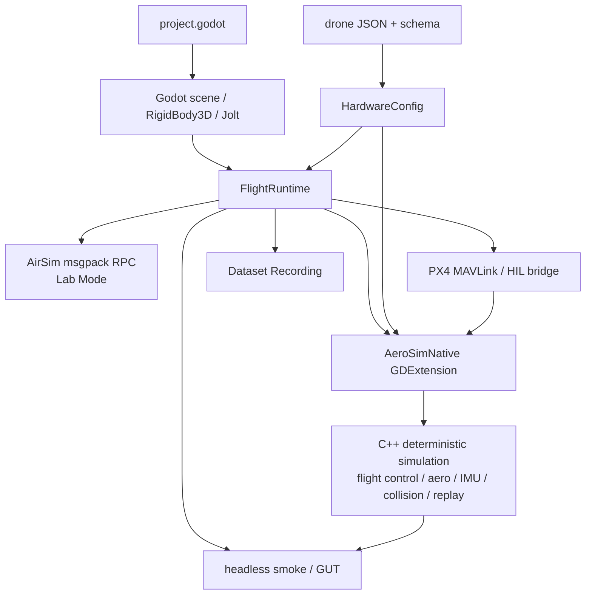
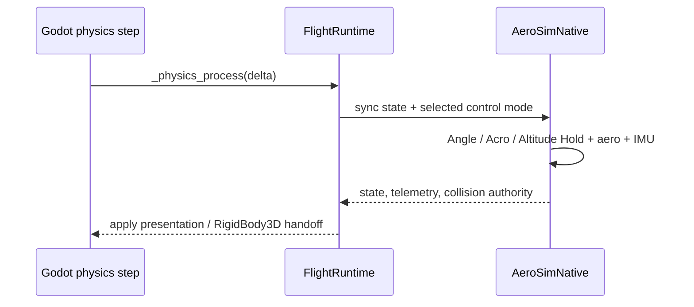
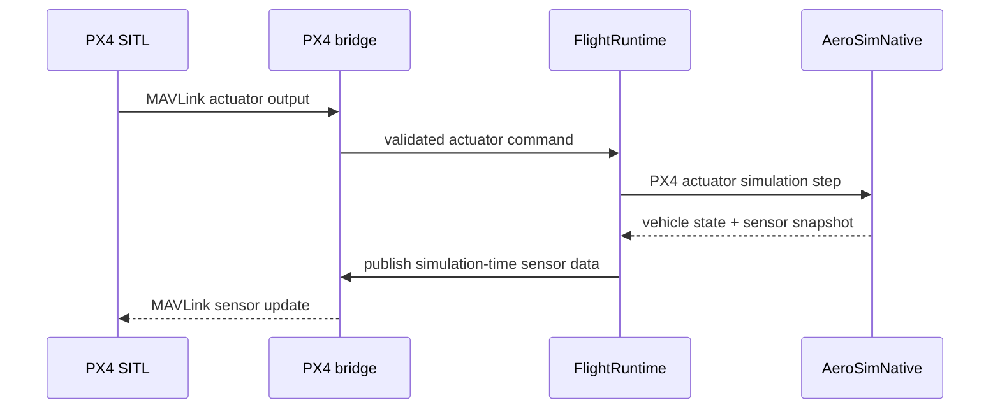
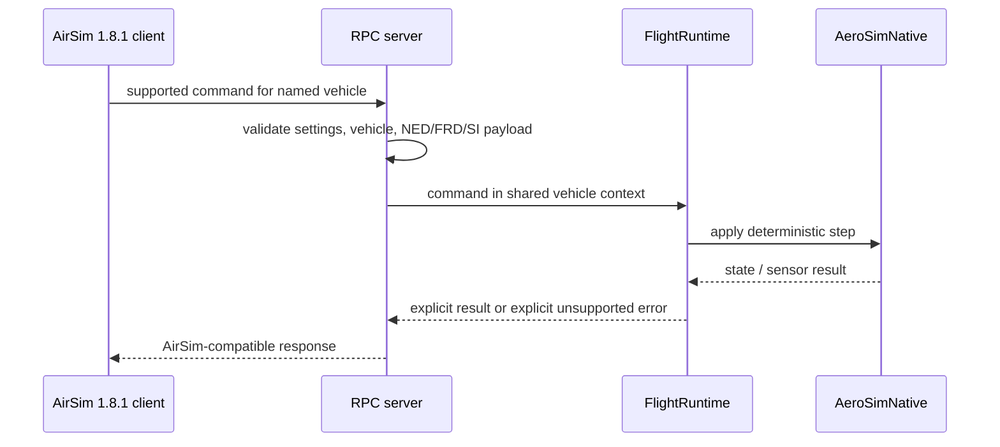
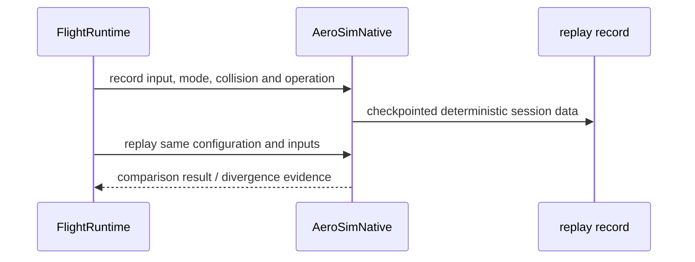

# AeroSim 運行時架構

Godot 擁有場景、Jolt 碰撞與呈現；原生 C++ 核心擁有確定性飛行、控制、感測器與重播。
兩者由 GDExtension 與 `FlightRuntime` 連接；`FlightRuntime` 是 composition root，不是純 UI。

## 擁有權與資料流

| 層 | 擁有什麼 | 不應擁有什麼 |
| --- | --- | --- |
| Godot scene / Jolt | Node3D、RigidBody3D、collision contact、camera、UI、reference environment 的呈現。 | 對外座標約定與 deterministic flight truth。 |
| FlightRuntime | 組合 Godot、native、input、config、AirSim、PX4 與 replay 的時序。 | 把 flight core 複製成 GDScript。 |
| AeroSimNative | simulation integration、flight controller、aerodynamics、IMU、collision authority handoff、telemetry、replay。 | Godot scene graph 與 UI。 |
| HardwareConfig + drone JSON | 機體物理與硬體參數的來源與驗證。 | 任意 runtime hard-coded airframe constants。 |
| AirSim / PX4 adapters | 把 external command、sensor payload、actuator output 轉進同一 runtime/vehicle context。 | 繞過 public coordinate contract 直接操作 Godot axes。 |

## 四個重要時序

### 1. 內建 flight-controller tick

### 2. PX4 lockstep tick

### 3. AirSim command

### 4. Flight Replay

## Contract Atlas

| 契約 | 白話用途 | 擁有者 | 權威來源 | 證據與驗證 | 狀態 |
| --- | --- | --- | --- | --- | --- |
| External Coordinate Contract | 所有 public spatial payload 只用 NED／FRD／SI；Godot Y-up 留在內部。 | coordinate contract module | `common/rpc/airsim_coordinate_contract.gd`、ADR 0011 | coordinate contract GUT fixtures | Confirmed target |
| GDScript ↔ native boundary | Godot 透過註冊的 `AeroSimNative` methods 操作原生核心。 | GDExtension binding | `src/native/register_types.cpp`、`src/native/aerosim_native.cpp` | native binding、headless smoke | Foundation |
| airframe configuration | JSON/schema 參數同時驅動 Godot runtime 與 native models。 | HardwareConfig | `config/drone_schema.json`、`config/drones/`、`common/flight/hardware_config.gd` | hardware configuration native tests | Foundation |
| AirSim / PX4 boundary | AirSim command 與 PX4 actuator 都進同一 vehicle/runtime context。 | RPC server / PX4 bridge | `common/rpc/airsim_rpc_server.gd`、`common/rpc/px4_sitl_bridge.gd`、compatibility manifest | RPC、PX4 bridge、coordinate tests | Confirmed target |
| Sensor Timebase | sensor timestamp 只取 simulation time；pause 不會偷走時間。 | AirSimSession / sensor suite | `common/rpc/airsim_session.gd`、`common/rpc/airsim_sensor_suite.gd` | sensor rate、pause 與 deterministic fixture tests | Confirmed target |
| Replay / Dataset boundary | replay 重建控制與條件；dataset 保留時間對齊觀測，兩者不可互稱。 | native replay / recording pipeline | `src/native/aerosim_native.cpp`、`docs/dataset_recording.md` | replay integration 與 dataset validation | Foundation / Confirmed target |

## 改動後跑什麼

| 改動範圍 | 先讀 | 首選驗證 |
| --- | --- | --- |
| native flight / aero / collision / IMU / replay | native core 與 hardware config | `tests/native/test_*.cpp`、`scripts/test_native.sh` |
| Godot ↔ GDExtension boundary | FlightRuntime、AeroSimNative binding | headless smoke |
| AirSim / PX4 / coordinates | coordinate contract、RPC server、PX4 bridge | 對應 GUT 與 headless integration harness |
| Linux 綜合 gate | CI 與驗收規則 | `scripts/verify_issue_11.sh` |
